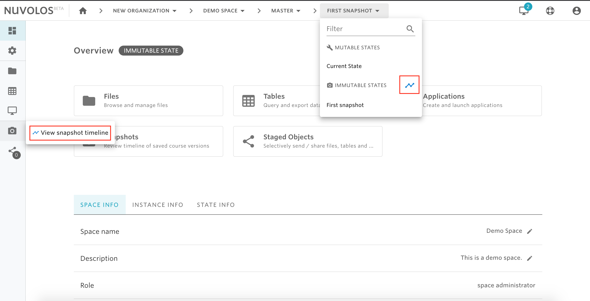

# Delete a snapshot

**To delete a snapshot:**

1- Open a space.

2- Go to the timeline view of snapshots, which you can do via the toolbar breadcrumbs or from the left sidebar.

3- Identify the snapshot you want to delete.

4- Click on the bin icon next to the snapshot name.

5- You will be asked to confirm the operation, and if you want to proceed click on "I understand" and then "DELETE SNAPSHOT"

#### If you are encountering a problem deleting a snapshot, refer to the troubleshooting guide [here](../../troubleshooting/authorization-issues/cannot-delete-a-snapshot.md).

****
