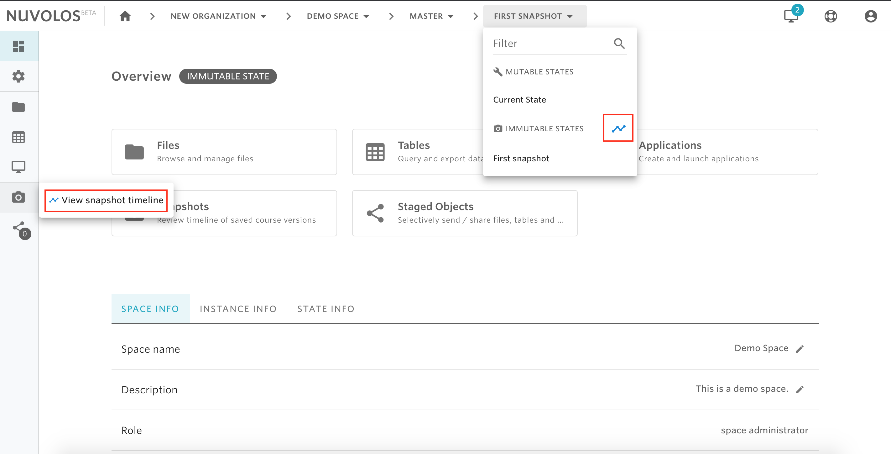
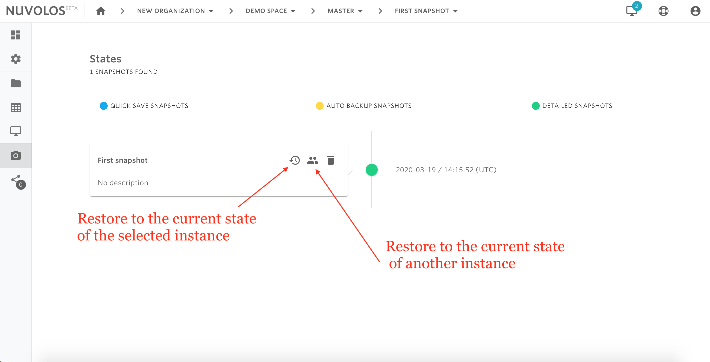
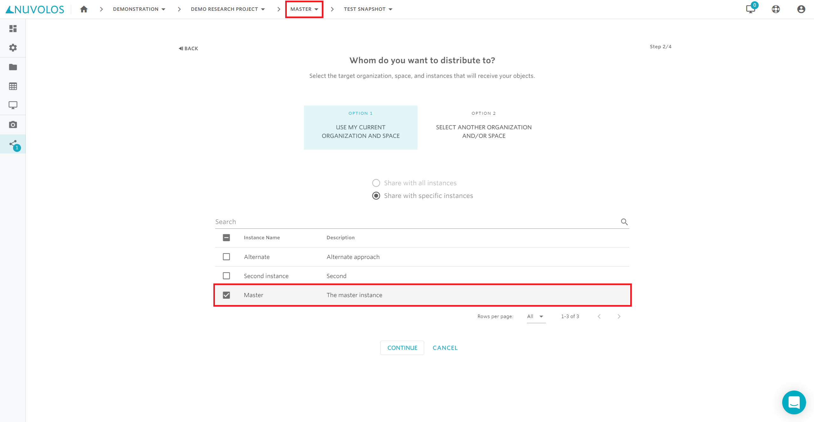

# Restore a snapshot


Restoring a snapshot means replacing the content of the current state with the content of the snapshot being restored. Make sure that you have the right permission to restore a snapshot. Only instance editors are allowed to restore snapshots. If you don't have the right permissions to restore a snapshot, then you can either ask the instance editor to do so, or you can ask the instance editor to share the snapshot in your instance and where can work with that snapshot.  


## **Restore a snapshot**

1. Open your space.

2. Go to the timeline view of snapshots, which you can do via the toolbar breadcrumbs or from the left sidebar.

3. Identify the snapshot you want to restore.

4. If you want to restore the snapshot to the current state of the currently selected instance, then click on the restore icon next to the snapshot name. Otherwise, if you want to restore the snapshot to the current state of another instance \(of which you should be an editor\) then click on the two persons icon.

5. If you chose to restore to the current state of the selected instance, then you will need to confirm the operation. Otherwise, if you chose to restore to another instance, then you will be asked to select the target instance.


Regardless of the target instance selected, an automatic snapshot of the current state of the target instance will be created before restoring the snapshot. This allows the user to revert the restoration operation.


## Partially restore a snapshot

It is possible to partially restore a snapshot via the [distribution feature](../distribute-objects-in-nuvolos/) of Nuvolos.

The steps to take are the following:

1. [Navigate to the snapshot](../navigation-in-nuvolos.md#the-breadcrumb) that you want to restore from.

    2. [Stage the objects](../distribute-objects-in-nuvolos/#distributing-a-selected-list-of-items-a-worked-example) \(files, tables or applications\) you want to restore.

    3. Select the same instance you are in as the distribution target.

    4. Proceed with the overwriting distribution strategy.

These steps will overwrite the selected files in the current state with the files that were stored in the snapshot.

