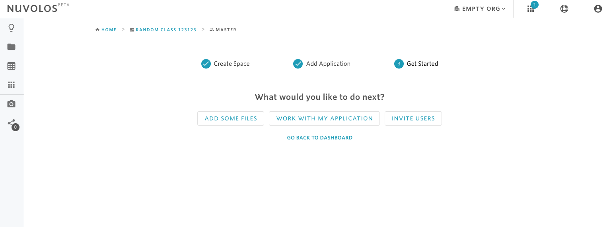

# Setting up a class

Nuvolos is an ideal solution for conducting educational activities such as teaching a university class, offering a summer school, organizing hands-on sessions, giving interactive presentations, and other academic training programs.

Classes with a substantial empirical or data-driven component often involve operations such as the collection, preparation and sharing of data, files, assignments and solutions between teachers and students, the installation and configuration of computational tools on various operating systems, the writing, execution, and sharing of code, and finally the production and re-production of analytical results. The more students a class has, the more it will result challenging to organize all these processes reliably and efficiently.

In this tutorial, you will learn how to set up a class with several students and manage the storing and sharing of different versions of files, data, and applications.

## Step 1: Create a space for the class.

To start a class, you have to create a space for it. Before creating a space, you have to select the organization where you want to host the class. A default organization is selected automatically at login but you can select another organization from the toolbar at the top.

 Once you have chosen the organization, create a space for your class following the steps described [here](../../actions/organization-management/create-a-space.md).

## Step 2: Upload files to your instance.

To start working on your class, you will need to have files and data that you want to upload to your work environment. To upload files, you need to open a space and navigate to the files view. For more details, follow the steps [here](../../actions/instance-management/upload-new-files.md).

## Step 3: Start a new application.

To work with your files, you will need to create and start an application. Say for example that you want to read a CSV file in Python. To do so, you first have to upload the CSV file to your current state following step 2. After that, you will need to create an application. Steps for creating an application are explained in detail [here](../../actions/instance-management/create-an-application.md). Once you have created an application, make sure that you are still working in the current state, and then follow the steps illustrated [here](../../actions/instance-management/start-an-application.md) for working with your file.

## Step 4: Invite students to join the class.

To add students to your class, you need to send an invitation to each student to join the space you have created in Nuvolos. As a space admin, you will be assigned the MASTER instance which you will use to interact with your students. Students instead will be invited to join Nuvolos, and a separate instance can be created for each student.   
  
To invite students, you first have to collect their email addresses to which you want to send the invitation. Once you have collected the emails, then you have to decide between creating an empty instance for each student, meaning that they will not have files in their work environment when they join Nuvolos, or you can share files with the instances to be created for each student. To invite students using one of these two options, follow the steps detailed [here](../../actions/space-management/create-an-instance/).

## Step 5: Share updates with the students.

If you want to to share a _new file_ \(e.g. assignment, homework,...\) with one or more students, then you need to first upload the file\(s\) to your current state \(step 2\). Upon uploading new files, you will see a blue snackbar at the bottom suggesting you to stage the newly uploaded files for sharing. Click on STAGE to stage the new files. After that, from the left sidebar click on DISTRIBUTE OBJECTS to share the new files with other instances. For more detail on the steps needed to distribute files, check [here](../../actions/instance-management/distribute-a-snapshot.md).

## Step 6: Check students\` progress.

You can ask your students to make snapshots of their work to meet certain deadlines \(e.g for an assignment\). The snapshot will become immutable and unaffected by later work of the students.

As the instructor, it is then possible to open the students\` instances and check the saved work states \(and whether they were saved on-time\) and provide feedback to the students.

