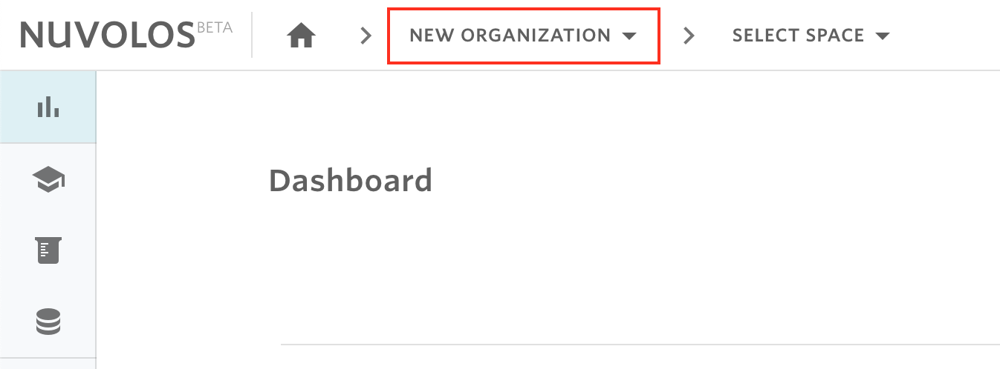
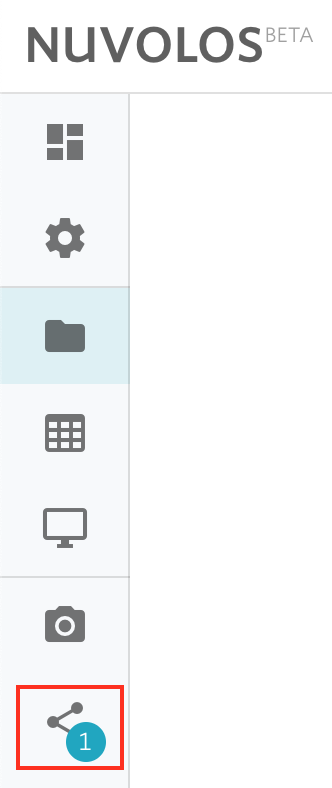

# Setting up a research project

Research projects are often group projects with complex and recurring interactions involving the collection, cleaning, and storage of data, the sharing of data between researchers, the sharing of different versions of code and files, the production and re-production or results, and the exchange of feedback.

Nuvolos offers an efficient and organized solution for conducting research projects that aim to maximize both research productivity and reproducibility. Different versions of work (files, data, and applications) can be packaged together, shared easily with other colleagues who can run the analysis and reproduce the same results. New results can be related to past outcomes with confidence as different components of the research process (data vintage, pre-processing, analysis approach) can be separately altered whilst keeping other components fixed. All of these steps are done within Nuvolos platform.

In this tutorial, you will learn how to set up a research project with multiple collaborators and manage the storing and sharing of different versions of work.

## Step 1: Create a space for the research project

To start a research project, you have to create a space for it. Before creating a space, you have to select the organization where you want to host the research project. A default organization is selected automatically at login but you can select another organization from the toolbar breadcrumbs.

Once you have chosen the organization, create a space for your research project following the steps described [here](../../actions/organization-management/create-a-space.md).


When creating a space, you will be offered the option to create an application for the research project.


## Step 2: Upload files to your instance

To start working on your research project, you will need to have files and data that you want to upload to your work environment. To upload files, you need to open a space and navigate to the files view. For more details, follow the steps [here](../../actions/work-with-files-in-nuvolos/upload-files-and-folders.md).

## Step 3: Invite researchers to join the research project

To add researchers to your project, you need to send an invitation to each researcher to join the space you have created in Nuvolos. As a space admin, you will be assigned a MASTER instance which you will use to exchange contents with your collaborators. Collaborators instead will be invited to join Nuvolos and a separate instance will be created for each.\
\
To invite collaborators, follow the steps detailed [here](../../actions/space-management/create-an-instance.md).

## Step 4: Share updates with your collaborators

If you want to to share a _new file_ (e.g. code, data,...) with one or more collaborators, then you need to first upload the file(s) to your current state (step 2). Upon uploading new files, you will see a blue snack bar at the bottom suggesting you to stage the newly uploaded files for sharing. Click on STAGE to stage the new files.&#x20;

After that, from the left sidebar click on the share icon to share the new files with other instances.&#x20;

Then follow the steps detailed [here](../../actions/distribute-objects-in-nuvolos/).

## Step 5: Check and reproduce your collaborators\` results

You can ask your collaborators to make snapshots of their work to see and give feedback on their results. The snapshot will become immutable and unaffected by later work of the collaborators. This will give researchers the advantage of tractability and reproducibility of their results. Steps for creating a snapshot are detailed [here](../../actions/instance-management/create-a-snapshot.md).

To reproduce the research results obtained at a specific point in time, the researcher can [restore](../../actions/instance-management/restore-a-snapshot.md) the snapshotted state and run the analysis again.

