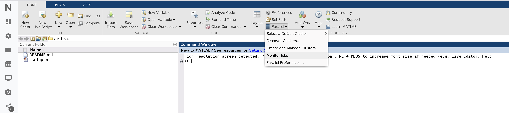

# HPC Computing on Demand

## Overview

The Scientific Cloud Cluster \(SCC\) is an elastic computing platform, providing the compute resources to run computation-intensive tasks or long-running computations in the Nuvolos cloud. The basic package subscription does not cover access to SCC, and users have to apply for access before being able to use it. 

### Compute resources

SCC compute resources are grouped into different sets called partitions \(a.k.a. queues\). Each partition contains non overlapping nodes with different capacities and optimal use cases:

* The nodes in the `defq` partition feature **10 physical cores \(20 virtual cores\) and 38 GB RAM**. This queue is used exclusively for running MATLAB. Please send your MATLAB jobs here even if you use SLURM-orchestrated parallelization.
* The nodes in the `sharedq` partition feature **4 physical cores \(8 virtual cores\) and 16 GB RAM**. This partition is used for submitting generic jobs in R, Python, Stata, Julia or any other support software. 
* The `intq` partition consists of a single node. This node has **8 physical cores \(16 virtual cores\) and 250 GB RAM**, and it is also equipped with **3 Tesla GPUs**. This is the default queue for the interactive cloud applications in Nuvolos.
* The `eduq` partition consists of two nodes with  **5 physical cores \(10 virtual cores\) and 16 GB RAM**. This queue is accessible only for educational purposes in the context of academic courses. 

## Access

### Secure Shell \(ssh\)

Secure shell is the usual way to gain shell access to Linux based systems, such as the HPC clusters. There are many choices of clients available depending on the system you are using to connect. SCC supports only public key authentication. An SSH key is an access credential in the [SSH protocol](https://www.ssh.com/ssh/protocol/). Its function is similar to that of user names and passwords.

Login node: hpc.nuvolos.cloud

```bash
ssh <your_username>@hpc.nuvolos.cloud
```

### **Nuvolos.tools**

\*\*\*\*

## Managing jobs

SCC uses [SLURM](https://slurm.schedmd.com/) as workload and resource manager. Convenient SLURM commands:

List your active jobs

```bash
squeue
```

Customize the output of the command by supplying a format string with the `-o` flag. Example \(wider column width for the job name\):

```text
squeue -o "%.18i %.9P %.70j %.8u %.2t %.10M %.6D %R"
```

Further details available [here](https://slurm.schedmd.com/squeue.html) about how to set up a custom format string.

View details for your jobs

```text
scontrol show job <jobid>
```

This will show you the location of the log file, which can be useful for debugging errors.

Cancel your job

```text
scancel <jobid>
```

You can only cancel your own jobs.

View your jobs history

```text
sacct -S <YYYY-MM-DD> --format=User%20,JobID,Jobname%30,partition,state,start,end,elapsed,nnodes,ncpus,nodelist
```

This will display some basic stats for all your jobs you have submitted on or after YYYY-MM-DD. You can read more [here](https://slurm.schedmd.com/sacct.html) about how to customize the format string.

## Matlab

There are 2 ways to leverage MATLAB’s parallelization features using SCC:

* SLURM-orchestrated parallelization
* MATLAB-orchestrated parallelization

The above terms can be a bit misleading first since, under the hood, the MATLAB-orchestrated parallelization also uses SLURM. However, the terms reflect the difference in the governance: in the first case, SLURM controls MATLAB, in the second case MATLAB leverages SLURM to manage its parallel execution.

When should you prefer one over the other? Some best practices:

* If you have a MATLAB script with parallelization features \(e.g. parfor\) that you want to run on a single node with multiple cores, you might want to choose the SLURM-orchestrated option, as you can perform job submission and monitoring from the command line. However, you’ll be constrained by the number of cores on a single node.
* If you have a MATLAB script with parallelization features \(e.g. parfor\) that demand more resources than a single node can provide, you might want to consider the MATLAB-orchestrated option. Once you configure your job in MATLAB, you’ll be able to run, monitor and possibly post-process your results from within MATLAB.

### SLURM-orchestrated parallelization

Use SLURM to orchestrate MATLAB code execution: as with any other application, allocate a compute node with SLURM and have it execute MATLAB script\(s\). With MATLAB’s Parallel Computing Toolbox, we can easily utilize the one-node, multi-core setting: we define a local parallel pool, and we leave it to MATLAB to spawn worker processes and to distribute the work among them. Of course we can only expect speedup if the number of workers in the local parallel pool is not larger than the number of cores available to the job.

One potential upside is that we can submit/monitor the jobs directly from the command line. This can actually be the downside as well: if we want to post-process the results of multiple runs, we need to use the command line too.

Imagine the following: we use SLURM to schedule 100 jobs, and each produce an `output_jobId_***.csv` file. If we want to merge the files and run some further analysis on them, then it’d probably make sense to use the MATLAB-orchestrated parallelization instead: there, we can easily collect all results and post-process them in one go.

We now discuss 2 examples for SLURM-orchestrated execution. The source files for both examples can also be found at `/apps/examples/matlab/`, accessible from both the login and any compute node.

#### **Parfor-based parallelization**

One natural way to parallelize a script in MATLAB is to use [parfor](https://uk.mathworks.com/help/distcomp/parfor.html). It’s a relatively simple to create a job leveraging its features:

First we create the script to be run, called `parallel_example.m`. Note that we create \(and destroy\) a local parallel pool explicitly. This tells MATLAB to spawn as many workers and we have SLURM allocated cores.

```text
%============================================================================
% Parallel Monte Carlo calculation of PI
%============================================================================
parpool('local', str2num(getenv('SLURM_CPUS_PER_TASK')))
R = 1;
darts = 1e7;
count = 0;
tic
parfor i = 1:darts
   % Compute the X and Y coordinates of where the dart hit the...............
   % square using Uniform distribution.......................................
   x = R*rand(1);
   y = R*rand(1);
   if x^2 + y^2 <= R^2
 % Increment the count of darts that fell inside of the.................
 % circle...............................................................
count = count + 1; % Count is a reduction variable.
   end
end
% Compute pi.................................................................
myPI = 4*count/darts;
T = toc;
fprintf('The computed value of pi is %8.7f.n',myPI);
fprintf('The parallel Monte-Carlo method is executed in %8.2f seconds.n', T);
delete(gcp);
exit;
```

We create a SLURM submission script `parallel_example.sbatch` to request the resources. Note that we only request one node, with 8 cores. Also, we use the `srun` command in the last line to define a job step that actually runs the script. All 8 allocated cores will be made available to the invoked MATLAB instance, which will execute the `parallel_example.m` script.

```text
#!/bin/bash

#SBATCH --output=parallel_example_%j.out
#SBATCH --error=parallel_example_%j.err
#SBATCH --nodes=1
#SBATCH --cpus-per-task=8
#SBATCH --partition=defq

module load matlab/R2018b
srun -n 1 -c 8 matlab -nosplash -nodesktop -r "parallel_example"
```

Submit the script using `sbatch parallel_example.sbatch`.

#### **SPMD-based parallelization**

MATLAB also supports a [single program multiple data](https://uk.mathworks.com/help/distcomp/spmd.html) \(SPMD\) parallel programming model, which allows for a greater control over the parallelization: different tasks can be assigned to different MATLAB workers depending on their ids.

Create a MATLAB script following the SPMD model. Note that we still need to create the local parallel cluster. Also, the parallel workers are called ‘labs’ in this model.

```text
%====================================================================
% Illustration of SPMD Parallel Programming model with MATLAB
%====================================================================
parpool('local', str2num(getenv('SLURM_CPUS_PER_TASK')))
% Start of parallel region...........................................
spmd
  nproc = numlabs;  % get total number of workers
  iproc = labindex; % get lab ID
  if ( iproc == 1 )
    fprintf ( 1, ' Running with  %d labs\n', nproc );
  end
  for i = 1: nproc
    if iproc == i
       fprintf ( 1, ' Rank %d out of  %d\n', iproc, nproc );
    end
  end
% End of parallel region.............................................
end
delete(gcp);
exit;
```

Again create a submission script called `spmd_example.m`.

```text
#!/bin/bash

#SBATCH --output=spmd_example_%j.out
#SBATCH --error=spmd_example_%j.err
#SBATCH --nodes=1
#SBATCH --cpus-per-task=8
#SBATCH --partition=defq

module load matlab/R2018b
srun -n 1 -c 8 matlab -nosplash -nodesktop -r "spmd_example"
```

Submit the script using `sbatch spmd_example.sbatch`.

For limitations and other considerations check out the FAQ section.

### MATLAB-orchestrated parallelization

In this setup, we use MATLAB’s [Parallel Server](https://www.mathworks.com/products/matlab-parallel-server.html) to take care of resource allocation. We define our resource needs in MATLAB code, and MATLAB will take care of allocating the compute nodes, starting a parallel pool with the workers, etc. Note that in this case, the MATLAB workers might reside on separate compute nodes \(under the hood, the Parallel Server still uses SLURM as its scheduler\). Moreover, since we’re defining and submitting the job using a script, we can conveniently do pre- or post processing as well.

To execute a MATLAB script or function on the Parallel Server, we’ll have to define and submit a job. MATLAB supports a variety of job types to exploit the power of parallel code execution. Here we review the two most common examples:

* **CommunicatingJob**

  This is the most advanced job type offered by MATLAB, which can leverage native language-level parallelization features like [parfor](https://uk.mathworks.com/help/distcomp/parfor.html). In this job, you typically have a single task, but a pool of workers. It is MATLAB’s responsibility to coordinate the distribution of the workload between the workers. It is done in a queue-based fashion: if you have 40 iterations in your parfor loop and requested 4 workers, then MATLAB will assign the first 4 iterations to the 4 workers. Once one of them finishes, it receives the 5th iteration to compute. The second one to finish will get the 6th iteration, and so on, until all iterations are completed. They are most convenient when the number of iterations are not known beforehand, or when you want to perform post-processing on the results of the iterations.

* **IndependentJob**

  In this job type, you typically have one job, but many tasks \(array job\). The tasks are executed independently, in arbitrary order. You cannot use the parfor construct with these jobs. They are mostly used in the ‘single program, multiple data’ context: when you want to run a MATLAB function with different sets of input parameters. If you have a fixed number of cases you want to cover, this job type can be a better choice, as the overhead is less compared to communicating jobs, as the resource allocation is done by you instead of MATLAB \(through specifying each task upfront\).

#### **Monitor Jobs**

The Job Monitor displays the jobs in the queue. Open the Job Monitor from the MATLAB desktop on the Home tab in the Environment section, by selecting **Parallel** &gt; **Monitor Jobs**.



The job monitor lists all the jobs that exist for the cluster specified in the selected profile. You can choose any one of your profiles \(those available in your current session Cluster Profile Manager\), and whether to display jobs from all users or only your own jobs.

#### Typical Use Cases <a id="bu6vtxu"></a>

The Job Monitor lets you accomplish many different goals pertaining to job tracking and queue management. Using the Job Monitor, you can:

* Discover and monitor all jobs submitted by a particular user
* Determine the status of a job
* Determine the cause of errors in a job
* Delete old jobs you no longer need
* Create a job object in MATLAB for access to a particular job in the queue

#### Manage Jobs Using the Job Monitor <a id="bs6wi5c-1"></a>

Using the Job Monitor you can manage the listed jobs for your cluster. Right-click on any job in the list, and select any of the following options from the context menu. The available options depend on the type of job.

* **Cancel** — Stops a running job and changes its state to `'finished'`. If the job is pending or queued, the state changes to `'finished'` without ever running. This is the same as the command-line [`cancel`](https://www.mathworks.com/help/parallel-computing/parallel.task.cancel.html) function for the job.
* **Delete** — Deletes the job data and removes the job from the queue. This is the same as the command-line [`delete`](https://www.mathworks.com/help/parallel-computing/parallel.job.delete.html) function for the job. Also closes and deletes an interactive pool job.
* **Show Details** — This displays detailed information about the job in the Command Window.
* **Show Errors** — This displays all the tasks that generated an error in that job, with their error properties.
* **Fetch Outputs** — This collects all the task output arguments from the job into the client workspace.

#### **Running a simple communicating job**

A simple communicating job example is available in the following folder: `<MATLAB_root_folder>/toolbox/local/alphacruncher/examples/communicatingJob_simple` 

In the MATLAB terminal, execute `edit prime_job_comm.m` to open the job description file in the Editor.

This simple job computes the number of primes from 2 until 1000. The computation is structured in 3 files:

* **prime\_job\_comm.m**

  This file contains the settings for the job. You need to execute this script to start the cluster job. Note that we define one job with only one task in this case.

* **prime\_start\_comm.m**

  This file contains the ‘main’ function \(a.k.a. entry point\) that the job executes. Generally you load/initialize variables in this function, and you aggregate results here.

* **prime\_comm.m**

  This file contains the actual implementation of the prime counting function. Look for the use of parfor in the file to see how the computation is parallelized.

> In MATLAB, you should only use one parfor, at the highest layer possible. If you nest a parfor loop in another parfor loop, MATLAB will simply execute the nested parfor sequentially. Read more on the topic [here](https://uk.mathworks.com/help/distcomp/nested-parfor-loops-and-for-loops.html).

**Running a simple independent job**

A simple independent example is available in the following folder: `<MATLAB_root_folder>/toolbox/local/alphacruncher/examples/independentJob_simple` 

In the MATLAB terminal, execute `edit prime_job_ind.m` to open the job description file in the Editor.

This simple job computes the number of primes for 3 different cases

* from 2 until 10
* from 2 until 100
* from 2 until 1000

The computation is structured in 3 files:

* **prime\_job\_ind.m**

  This file contains the settings for the job. You need to execute this script to start the cluster job. Note that we define one job, but 3 tasks in this case. Each task calls the same main function, but with different parameters.

* **prime\_start\_ind.m**

  This file contains the ‘main’ function \(a.k.a. entry point\) that the job executes. Generally you load/initalize variables in this function, and you aggregate results here. For independent jobs, your entry file should have input parameters. 

* **prime\_ind.m**

  This file contains the actual implementation of the prime counting function. Note the absence of parfor in this implementation: this function is purely sequential.

## FAQ

* **How many MATLAB workers can I allocate for my job?**

  In our experience, each MATLAB job sooner or later reaches a point where adding more compute nodes does not increase the overall performance much. For your own benefit and courtesy towards other MATLAB users, we recommend not to allocate more than 40 workers for any job in the `defq` and maximum of four in the `intq`.

* **How do I monitor my MATLAB jobs?**

  If you’ve chosen the MATLAB-orchestrated parallelization, you can use MATLAB’s GUI to monitor your job’s state as described in the MATLAB monitor section. If you’ve used `sbatch` to submit your job directly, you can use the generic SLURM commands to monitor your job as described in the monitor section.

* **How do I modify the path of the MATLAB workers on SCC from a SLURM sbatch file?**

  You can use the “-r” flag of MATLAB to execute multiple commands in sequence. Example: `srun -n 1 -c 8 matlab -nodisplay -nosplash -r "addpath('/beegfs/swift/alphacruncher.net/<your_username>/MATLAB/toolbox/<custom_toolbox>'),parallel_example,exit"`

* **I’d like to run my MATLAB script in parallel, with a different set of inputs. Which job setup should I use?**

  You should use the IndependentJob job type. Check example simple independent job.

* **I’d like to parallelize my computationally demanding MATLAB script. Which job setup should I use?**

  You should use the CommunicatingJob job type. Check the example simple communicating job.

* **How can I save variables inside a parfor loop?**

  MATLAB does not allow the use of the built-in save function inside parfor loops. To get around this problem, we’ve created an auxiliary ‘parsave’ function for your convenience that will work within parfor loops. `parsave` saves variable\(s\) to .mat files from within parfor loops.

