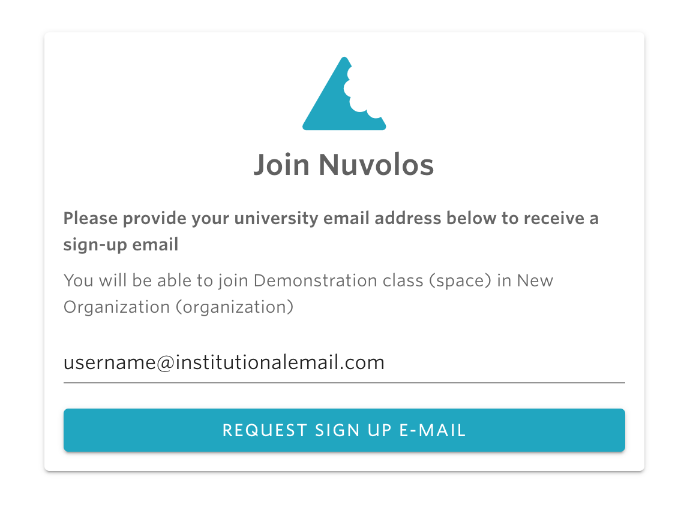
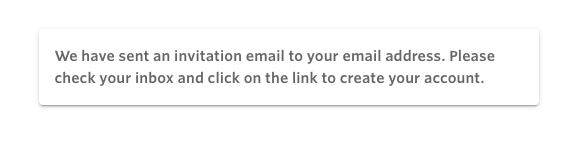
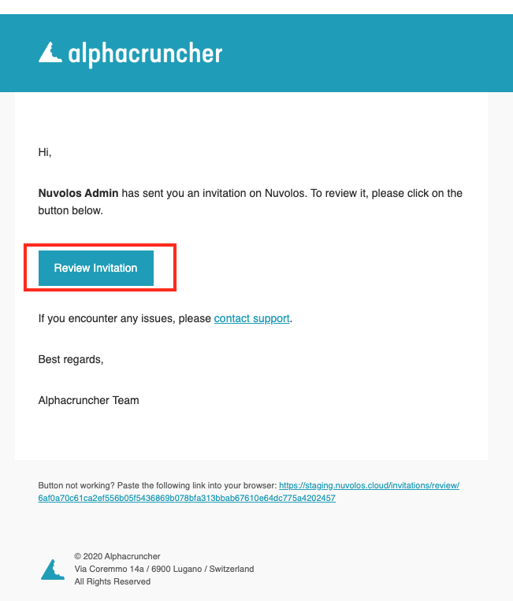

# Getting started with a class

## **To get started with a class, here are the steps to follow:**

## 1. Use the link provided by your professor to ask for an invitation.

Your professor \(or the teaching assistant\) should provide you with a link that you can use to ask for an invitation to join a class. Once you have the link, paste it into the browser and you will be asked to provide your institutional email address.

Once done, click "REQUEST SIGN UP E-MAIL" and you should see a message like this:

## 2. **Accept invitation.**

Check your email address for an email with a tiltle like "Someone has sent you an invitation" and open it. You should see something like:

Click on the Review Invitation button.


In case you haven't received an invitation email, please check the troubleshooting documentation available [here](../../troubleshooting/login-issues/i-havent-received-an-invitation-email.md).


Several options are currently available to accept the invitation. If you are a member of a Swiss academic institution \(e.g. University of Lugano\), choose the option “**I have a Swiss University account**” and sign in with your institution credentials. Contingent on successful authentication, the invitation is confirmed, and sign-in to class happens automatically.  

## 2. Start application

The Nuvolos Dashboard home page provides useful at-a-glance information about the status of your applications and your membership in [organizations](http:///@alphacruncher-1/s/datahub/~/drafts/-LpMzyPUrAQ03FcWCTT_/primary/data-organization/organizations). Use the links on the right side of each application to manage it, e.g. to  **START** or **STOP** it. The screenshot below exemplifies an RStudio application deployed and ready to start.

### Concurrent instances of applications are currently not supported in different browser tabs / windows.

## ​3. Open and work with files from the application.

Teaching material, e.g. example code or assignments, can be distributed by the instructor of the class. Such content becomes available in your working directory \(the default working directory is /files\). For example, you are working with an RStudio application with content available inside a folder called **week\_01**. In the bottom right pane of the RStudio application choose the **FILES** tab to see the available material \(similar to the screenshot below\). Clicking on the R file, you will be able to see and work with it in the R console.

## 4. Switch to another application?

Use the hamburger button \(three-lines icon in the top-left corner\) of the Nuvolos toolbar to toggle the navigation menu.

Switch to another of your current running applications or navigate to the dashboard.

