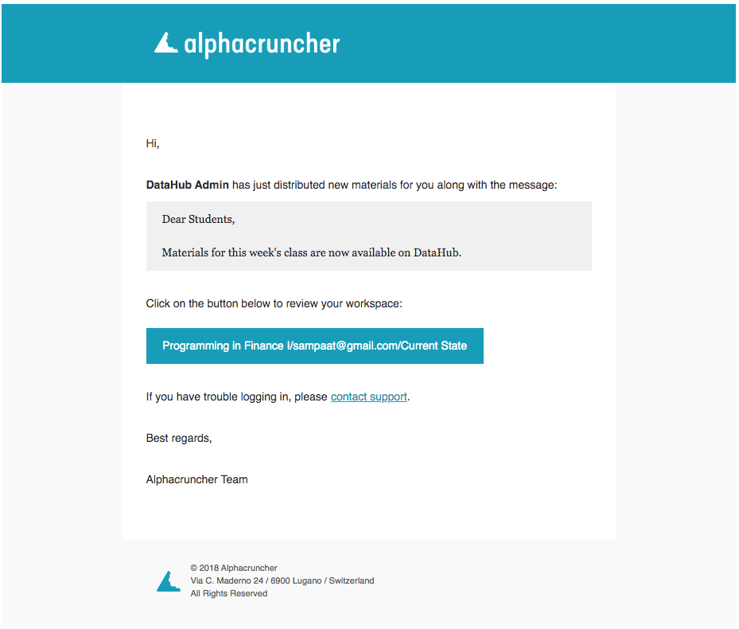
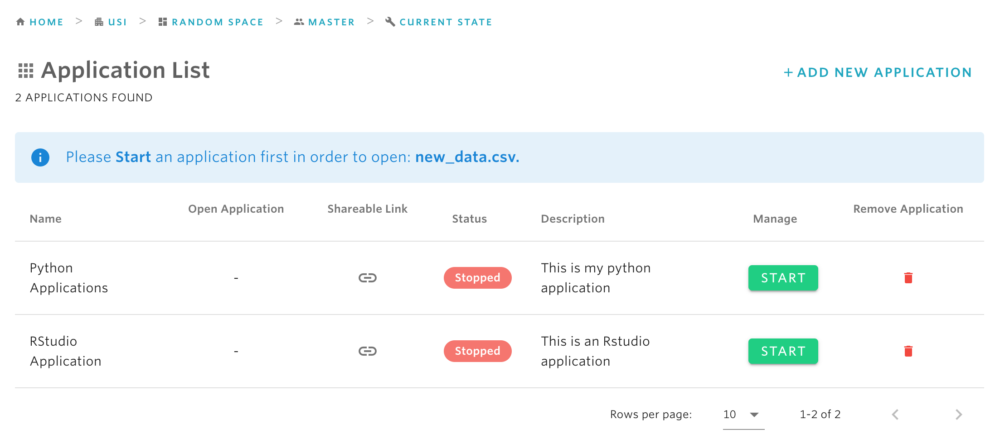
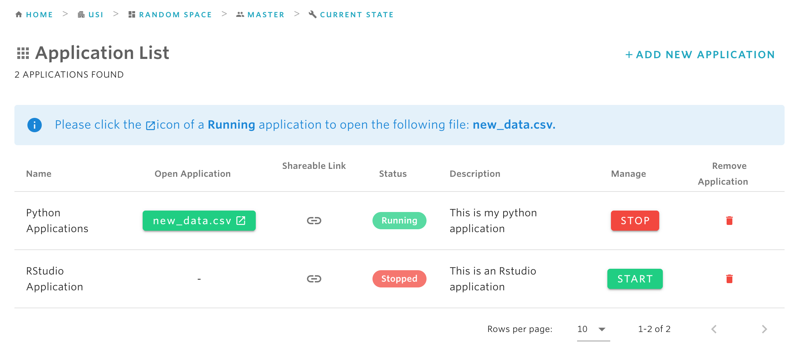

# Review distributed material

As a student, you are likely to receive material that has been distributed from your teacher. Once the teacher shares new material with you, you will receive a notification email where you can review what was shared. Below is a screenshot of how the review email looks like:

From the email, click on on the blue button \(which contains as a text **ORGANIZATION NAME/INSTANCE NAME/Current State\)** to see your list of files. For example, suppose your teacher shares a new file called **new\_data.csv** with you, then the new file will be displayed in the list of workspace files \(see the screenshot below\).

To work with the newly distributed files using one of your applications, simply click on the file and this will take you to the list of your applications.

If none of your applications are currently running, you will need to first start the application with the START button and then open it with the  \[FILE NAME\] green button under Open Application. If instead your application is already running, then you can simply use the \[FILE NAME\] button.

