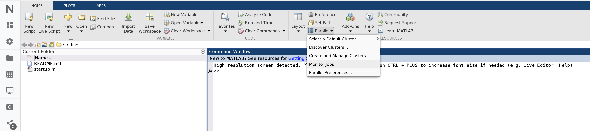

# High-performance computing

## Overview

The Scientific Cloud Cluster \(SCC\) is an elastic computing platform, providing the compute resources to run computation-intensive tasks or long-running computations in the Nuvolos cloud. The basic package subscription does not cover access to SCC, and users have to apply for access before being able to use it. 

### Compute resources

SCC compute resources are grouped into different sets called partitions \(or queues\). Each partition contains non overlapping nodes with different capacities and optimal use cases:

* The nodes in the `defq` partition feature **10 physical cores \(20 virtual cores\) and 38 GB RAM**. This queue is used exclusively for running MATLAB. Please send your MATLAB jobs here even if you use SLURM-orchestrated parallelization.
* The nodes in the `sharedq` partition feature **4 physical cores \(8 virtual cores\) and 16 GB RAM**. This partition is used for submitting generic jobs in R, Python or any other supported software. 
* The `intq` partition consists of a single node. This node has **8 physical cores \(16 virtual cores\) and 250 GB RAM**, and it is also equipped with **3 Tesla GPUs**. This is the default queue for the interactive cloud applications in Nuvolos.
* The `eduq` partition consists of two nodes with  **5 physical cores \(10 virtual cores\) and 16 GB RAM**. This queue is accessible only for educational purposes in the context of academic courses. 

## Access

The HPC cluster can be accessed by connecting in some manner to the login node.


You can access the login node at:

**`hpc.nuvolos.cloud`**


### Secure Shell \(ssh\)

Secure shell is the usual way to gain shell access to Linux based systems, such as the HPC clusters. There are many choices of clients available depending on the system you are using to connect. SCC supports only public key authentication. An SSH key is an access credential in the [SSH protocol](https://www.ssh.com/ssh/protocol/). Its function is similar to that of user names and passwords.

```bash
ssh <your_username>@hpc.nuvolos.cloud
```

### **r-nuvolos-tools**

If you are working with R, Nuvolos offers a convenience package to connect to the login node while working inside your regular R environment. The detailed description of the package can be found [here](https://github.com/nuvolos-cloud/r-nuvolos-tools).

On a high level, the package lets you directly send R script files for HPC computation and offers a simple, lightweight interface.

### bash toolkit on Nuvolos

If you are working inside Nuvolos applications \(such as JupyterLab or Spyder\), and HPC integration is activated for your work area, you have acces to some convenience tools for the command line.

In particular, connecting to the cluster can be done by the following command:

```text
connect_cluster
```

More details can be found below.

## Managing jobs

SCC uses [SLURM](https://slurm.schedmd.com/) as workload and resource manager. In SLURM every job is issued a jobid, which is used to identify and manage jobs.

### List your active jobs

Listing the active queue in SLURM can be done by issuing the [`squeue`](https://slurm.schedmd.com/squeue.html)command.

```bash
squeue
```

Customize the output of the command by supplying a format string with the `-o` flag. Example \(wider column width for the job name\):

```text
squeue -o "%.18i %.9P %.70j %.8u %.2t %.10M %.6D %R"
```

Further details available [here](https://slurm.schedmd.com/squeue.html) about how to set up a custom format string.

### View details for your jobs

Job details can be queried by using the [`scontrol show job`](https://slurm.schedmd.com/scontrol.html)command. The scontrol command gives you a large amount of details, and will also show you the location of the log file, which can be useful for debugging errors.

```text
scontrol show job <jobid>
```

### Cancel your job

If you need to cancel a job, obtain its identifier \(via `squeue` or `scontrol`\) and then issue [`scancel`](https://slurm.schedmd.com/scancel.html). You can only cancel your own jobs.

```text
scancel <jobid>
```

### View your jobs history

The [`sacct`](https://slurm.schedmd.com/sacct.html) command is SLURM's accounting and history command. There are many possible parametrizations.

#### Job history after given date

You can display some basic stats for all your jobs you have submitted on or after YYYY-MM-DD by issuing the following command. You can read more [here](https://slurm.schedmd.com/sacct.html) about how to customize the format string.

```text
sacct -S <YYYY-MM-DD> --format=User%20,JobID,Jobname%30,partition,state,start,end,elapsed,nnodes,ncpus,nodelist
```

## Environment synchronization

In almost all cases, a key question is how you synchronize your code and software packages between the HPC cluster and the development environment in which you created your application. This section details what can be done for synchronization with Nuvolos applications.

### Understanding environments

In Nuvolos, every [application](../our-features/data-organization/applications.md) is mapped to a single environment. In particular, this means a separate package volume for every application. Synchronizing an environment is synonimous to mapping the package volume of a particular application and representing it on the HPC cluster. Consequently, environment synchronization is always understood in the context of running a Nuvolos application.

### Python and other conda-based applications

Support for synchronization is provided via the bash toolkit on Nuvolos. If HPC access is activated in your space, in any terminal with access to a conda environment you can issue the following commands in your terminal shell.

#### create\_cluster\_env

The command `create_cluster_env` generates a conda environment on the HPC cluster if it does not exist yet for the particular application you are using.

#### update\_cluster\_env

The command `update_cluster_env` exports the current application conda environment state and attempts to reflect it on the cluster by updating and adding appropriate packages. In case you update packages or package versions migrate during new dependency resolution when installing a new package to your conda environment, the command is necessary.

#### connect\_cluster\_env

The command `connect_cluster_env` connects to the cluster and activates the conda environment mapped to your environment on the cluster.

### R

R packages on Nuvolos are stored in a standard library structure. In order to reflect the R environment on the cluster the function `nuvolos.tools::package_sync_hpc` needs to be called.


The HPC cluster and the Nuvolos environment depend on different compilers and thus exact package versions might not represent exactly the same binaries. Although an edge case that might cause very infrequent issues, currently this cannot be ameliorated. We are working on a wholesale solution to address this issue and expect to deliver to our users in Q1 2021.


## Matlab

There are 2 ways to leverage MATLAB’s parallelization features using SCC:

* SLURM-orchestrated parallelization
* MATLAB-orchestrated parallelization

The above terms can be a bit misleading first since, under the hood, the MATLAB-orchestrated parallelization also uses SLURM. However, the terms reflect the difference in the governance: in the first case, SLURM controls MATLAB, in the second case MATLAB leverages SLURM to manage its parallel execution.

When should you prefer one over the other? Some best practices:

* If you have a MATLAB script with parallelization features \(e.g. parfor\) that you want to run on a single node with multiple cores, you might want to choose the SLURM-orchestrated option, as you can perform job submission and monitoring from the command line. However, you’ll be constrained by the number of cores on a single node.
* If you have a MATLAB script with parallelization features \(e.g. parfor\) that demand more resources than a single node can provide, you might want to consider the MATLAB-orchestrated option. Once you configure your job in MATLAB, you’ll be able to run, monitor and possibly post-process your results from within MATLAB.

### SLURM-orchestrated parallelization

Use SLURM to orchestrate MATLAB code execution: as with any other application, allocate a compute node with SLURM and have it execute MATLAB script\(s\). With MATLAB’s Parallel Computing Toolbox, we can easily utilize the one-node, multi-core setting: we define a local parallel pool, and we leave it to MATLAB to spawn worker processes and to distribute the work among them. Of course we can only expect speedup if the number of workers in the local parallel pool is not larger than the number of cores available to the job.

One potential upside is that we can submit/monitor the jobs directly from the command line. This can actually be the downside as well: if we want to post-process the results of multiple runs, we need to use the command line too.

Imagine the following: we use SLURM to schedule 100 jobs, and each produce an `output_jobId_***.csv` file. If we want to merge the files and run some further analysis on them, then it’d probably make sense to use the MATLAB-orchestrated parallelization instead: there, we can easily collect all results and post-process them in one go.

We now discuss 2 examples for SLURM-orchestrated execution. The source files for both examples can also be found at `/apps/examples/matlab/`, accessible from both the login and any compute node.

#### **Parfor-based parallelization**

One natural way to parallelize a script in MATLAB is to use [parfor](https://uk.mathworks.com/help/distcomp/parfor.html). It’s a relatively simple to create a job leveraging its features:

First we create the script to be run, called `parallel_example.m`. Note that we create \(and destroy\) a local parallel pool explicitly. This tells MATLAB to spawn as many workers and we have SLURM allocated cores.

```text
%============================================================================
% Parallel Monte Carlo calculation of PI
%============================================================================
parpool('local', str2num(getenv('SLURM_CPUS_PER_TASK')))
R = 1;
darts = 1e7;
count = 0;
tic
parfor i = 1:darts
   % Compute the X and Y coordinates of where the dart hit the...............
   % square using Uniform distribution.......................................
   x = R*rand(1);
   y = R*rand(1);
   if x^2 + y^2 <= R^2
 % Increment the count of darts that fell inside of the.................
 % circle...............................................................
count = count + 1; % Count is a reduction variable.
   end
end
% Compute pi.................................................................
myPI = 4*count/darts;
T = toc;
fprintf('The computed value of pi is %8.7f.n',myPI);
fprintf('The parallel Monte-Carlo method is executed in %8.2f seconds.n', T);
delete(gcp);
exit;
```

We create a SLURM submission script `parallel_example.sbatch` to request the resources. Note that we only request one node, with 8 cores. Also, we use the `srun` command in the last line to define a job step that actually runs the script. All 8 allocated cores will be made available to the invoked MATLAB instance, which will execute the `parallel_example.m` script.

```text
#!/bin/bash

#SBATCH --output=parallel_example_%j.out
#SBATCH --error=parallel_example_%j.err
#SBATCH --nodes=1
#SBATCH --cpus-per-task=8
#SBATCH --partition=defq

module load matlab/R2018b
srun -n 1 -c 8 matlab -nosplash -nodesktop -r "parallel_example"
```

Submit the script using `sbatch parallel_example.sbatch`.

#### **SPMD-based parallelization**

MATLAB also supports a [single program multiple data](https://uk.mathworks.com/help/distcomp/spmd.html) \(SPMD\) parallel programming model, which allows for a greater control over the parallelization: different tasks can be assigned to different MATLAB workers depending on their ids.

Create a MATLAB script following the SPMD model. Note that we still need to create the local parallel cluster. Also, the parallel workers are called ‘labs’ in this model.

```text
%====================================================================
% Illustration of SPMD Parallel Programming model with MATLAB
%====================================================================
parpool('local', str2num(getenv('SLURM_CPUS_PER_TASK')))
% Start of parallel region...........................................
spmd
  nproc = numlabs;  % get total number of workers
  iproc = labindex; % get lab ID
  if ( iproc == 1 )
    fprintf ( 1, ' Running with  %d labs\n', nproc );
  end
  for i = 1: nproc
    if iproc == i
       fprintf ( 1, ' Rank %d out of  %d\n', iproc, nproc );
    end
  end
% End of parallel region.............................................
end
delete(gcp);
exit;
```

Again create a submission script called `spmd_example.m`.

```text
#!/bin/bash

#SBATCH --output=spmd_example_%j.out
#SBATCH --error=spmd_example_%j.err
#SBATCH --nodes=1
#SBATCH --cpus-per-task=8
#SBATCH --partition=defq

module load matlab/R2018b
srun -n 1 -c 8 matlab -nosplash -nodesktop -r "spmd_example"
```

Submit the script using `sbatch spmd_example.sbatch`.

For limitations and other considerations check out the FAQ section.

### MATLAB-orchestrated parallelization

In this setup, we use MATLAB’s [Parallel Server](https://www.mathworks.com/products/matlab-parallel-server.html) to take care of resource allocation. We define our resource needs in MATLAB code, and MATLAB will take care of allocating the compute nodes, starting a parallel pool with the workers, etc. Note that in this case, the MATLAB workers might reside on separate compute nodes \(under the hood, the Parallel Server still uses SLURM as its scheduler\). Moreover, since we’re defining and submitting the job using a script, we can conveniently do pre- or post processing as well.

To execute a MATLAB script or function on the Parallel Server, we’ll have to define and submit a job. MATLAB supports a variety of job types to exploit the power of parallel code execution. Here we review the two most common examples:

* **CommunicatingJob**

  This is the most advanced job type offered by MATLAB, which can leverage native language-level parallelization features like [parfor](https://uk.mathworks.com/help/distcomp/parfor.html). In this job, you typically have a single task, but a pool of workers. It is MATLAB’s responsibility to coordinate the distribution of the workload between the workers. It is done in a queue-based fashion: if you have 40 iterations in your parfor loop and requested 4 workers, then MATLAB will assign the first 4 iterations to the 4 workers. Once one of them finishes, it receives the 5th iteration to compute. The second one to finish will get the 6th iteration, and so on, until all iterations are completed. They are most convenient when the number of iterations are not known beforehand, or when you want to perform post-processing on the results of the iterations.

* **IndependentJob**

  In this job type, you typically have one job, but many tasks \(array job\). The tasks are executed independently, in arbitrary order. You cannot use the parfor construct with these jobs. They are mostly used in the ‘single program, multiple data’ context: when you want to run a MATLAB function with different sets of input parameters. If you have a fixed number of cases you want to cover, this job type can be a better choice, as the overhead is less compared to communicating jobs, as the resource allocation is done by you instead of MATLAB \(through specifying each task upfront\).

#### **Monitor Jobs**

The Job Monitor displays the jobs in the queue. Open the Job Monitor from the MATLAB desktop on the Home tab in the Environment section, by selecting **Parallel** &gt; **Monitor Jobs**.



The job monitor lists all the jobs that exist for the cluster specified in the selected profile. You can choose any one of your profiles \(those available in your current session Cluster Profile Manager\), and whether to display jobs from all users or only your own jobs.

#### Typical Use Cases <a id="bu6vtxu"></a>

The Job Monitor lets you accomplish many different goals pertaining to job tracking and queue management. Using the Job Monitor, you can:

* Discover and monitor all jobs submitted by a particular user
* Determine the status of a job
* Determine the cause of errors in a job
* Delete old jobs you no longer need
* Create a job object in MATLAB for access to a particular job in the queue

#### Manage Jobs Using the Job Monitor <a id="bs6wi5c-1"></a>

Using the Job Monitor you can manage the listed jobs for your cluster. Right-click on any job in the list, and select any of the following options from the context menu. The available options depend on the type of job.

* **Cancel** — Stops a running job and changes its state to `'finished'`. If the job is pending or queued, the state changes to `'finished'` without ever running. This is the same as the command-line [`cancel`](https://www.mathworks.com/help/parallel-computing/parallel.task.cancel.html) function for the job.
* **Delete** — Deletes the job data and removes the job from the queue. This is the same as the command-line [`delete`](https://www.mathworks.com/help/parallel-computing/parallel.job.delete.html) function for the job. Also closes and deletes an interactive pool job.
* **Show Details** — This displays detailed information about the job in the Command Window.
* **Show Errors** — This displays all the tasks that generated an error in that job, with their error properties.
* **Fetch Outputs** — This collects all the task output arguments from the job into the client workspace.

#### **Running a simple communicating job**

A simple communicating job example is available in the following folder: `<MATLAB_root_folder>/toolbox/local/alphacruncher/examples/communicatingJob_simple` 

In the MATLAB terminal, execute `edit prime_job_comm_n.m` to open the job description file in the Editor.

This simple job computes the number of primes from 2 until 1000. The computation is structured in 3 files:

* **prime\_job\_comm\_n.m**

  This file contains the settings for the job. You need to execute this script to start the cluster job. Note that we define one job with only one task in this case.

* **prime\_start\_comm\_n.m**

  This file contains the ‘main’ function \(a.k.a. entry point\) that the job executes. Generally you load/initialize variables in this function, and you aggregate results here.

* **prime\_comm\_n.m**

  This file contains the actual implementation of the prime counting function. Look for the use of parfor in the file to see how the computation is parallelized.

> In MATLAB, you should only use one parfor, at the highest layer possible. If you nest a parfor loop in another parfor loop, MATLAB will simply execute the nested parfor sequentially. Read more on the topic [here](https://uk.mathworks.com/help/distcomp/nested-parfor-loops-and-for-loops.html).

**Running a simple independent job**

A simple independent example is available in the following folder: `<MATLAB_root_folder>/toolbox/local/alphacruncher/examples/independentJob_simple` 

In the MATLAB terminal, execute `edit prime_job_ind_n.m` to open the job description file in the Editor.

This simple job computes the number of primes for 3 different cases

* from 2 until 10
* from 2 until 100
* from 2 until 1000

The computation is structured in 3 files:

* **prime\_job\_ind\_n.m**

  This file contains the settings for the job. You need to execute this script to start the cluster job. Note that we define one job, but 3 tasks in this case. Each task calls the same main function, but with different parameters.

* **prime\_start\_ind\_n.m**

  This file contains the ‘main’ function \(a.k.a. entry point\) that the job executes. Generally you load/initalize variables in this function, and you aggregate results here. For independent jobs, your entry file should have input parameters. 

* **prime\_ind\_n.m**

  This file contains the actual implementation of the prime counting function. Note the absence of parfor in this implementation: this function is purely sequential.

### FAQ

* **How many MATLAB workers can I allocate for my job?**

  In our experience, each MATLAB job sooner or later reaches a point where adding more compute nodes does not increase the overall performance much. For your own benefit and courtesy towards other MATLAB users, we recommend not to allocate more than 40 workers for any job in the `defq` and maximum of four in the `intq`.

* **How do I monitor my MATLAB jobs?**

  If you’ve chosen the MATLAB-orchestrated parallelization, you can use MATLAB’s GUI to monitor your job’s state as described in the MATLAB monitor section. If you’ve used `sbatch` to submit your job directly, you can use the generic SLURM commands to monitor your job as described in the monitor section.

* **How do I modify the path of the MATLAB workers on SCC from a SLURM sbatch file?**

  You can use the “-r” flag of MATLAB to execute multiple commands in sequence. Example: `srun -n 1 -c 8 matlab -nodisplay -nosplash -r "addpath('/beegfs/swift/alphacruncher.net/<your_username>/MATLAB/toolbox/<custom_toolbox>'),parallel_example,exit"`

* **I’d like to run my MATLAB script in parallel, with a different set of inputs. Which job setup should I use?**

  You should use the IndependentJob job type. Check example simple independent job.

* **I’d like to parallelize my computationally demanding MATLAB script. Which job setup should I use?**

  You should use the CommunicatingJob job type. Check the example simple communicating job.

* **How can I save variables inside a parfor loop?**

  MATLAB does not allow the use of the built-in save function inside parfor loops. To get around this problem, we’ve created an auxiliary ‘parsave’ function for your convenience that will work within parfor loops. `parsave` saves variable\(s\) to .mat files from within parfor loops.

## R

There are three options to choose from when you plan to run HPC jobs in R.

1. From Nuvolos: use the r-nuvolos-tools package 
2. From Nuvolos: use shell commands 
3. Outside Nuvolos: use shell commands

In this section, only the r-nuvolos-tools package is discussed in detail as general job management tools are covered[ ](high-performance-computing.md#managing-jobs)[in a separate section](high-performance-computing.md#managing-jobs).

### **r-nuvolos-tools**

The developers of Nuvolos maintain the r-nuvolos-tools package on github as an open repository. For the latest documentation, always refer to the package source and documentation that can be found [here](https://github.com/nuvolos-cloud/r-nuvolos-tools).

The package offers convenience features for R users who are running RStudio applications from Nuvolos and want to use the HPC capabilities.

#### Connecting 

As pointed out, the HPC login node is located at `hpc.nuvolos.cloud`. For basic use cases, the package offers you the ability of not having to move to the terminal of RStudio to interact with the cloud. 

If you want to connect directly to the login node, please follow instructions [here](high-performance-computing.md#managing-jobs).

#### Submit jobs

The package implements a wrapper for the `sbatch` command via the `nuvolos.tools::sbatch` R function.

Some suggestions for its usage:

* On Nuvolos a synchronization happens between your workspace and the HPC workspace. In order for this to go through, you need to put scripts to be sent to submission under the path `~/files/`
* The function creates a job and returns control to R once the job submission is done. In order to gather results, a separate ingestion step has to be performed.

#### Checking status

You can issue the squeue command in R via the `nuvolos.tools::squeue` R function.

#### Canceling jobs

You can cancel jobs in R via the `nuvolos.tools::scancel` R function.

#### Synchronize libraries

 You can synchronize packages with the HPC cluster via the `nuvolos.tools::package_sync_hpc` R function.

For more details on environments and synchronization refer to [this section](high-performance-computing.md#environment-synchronization).

#### Interactive jobs

An interactive session and an HPC job are in general two orthogonal contexts for running code. For shorter expected runtime jobs, it is possible to not return control to R via using the `nuvolos.tools::run_job_interactive` R function. A batch job can thus be embedded into an interactive session, for example in order to generate plots directly in the same code as the calculation is called from.

## Python

Currently support for python environments is provided via the bash toolkit. You will need to use either Spyder's or JupyterLab's terminal to access this toolkit.

### Access

### Job control


.


