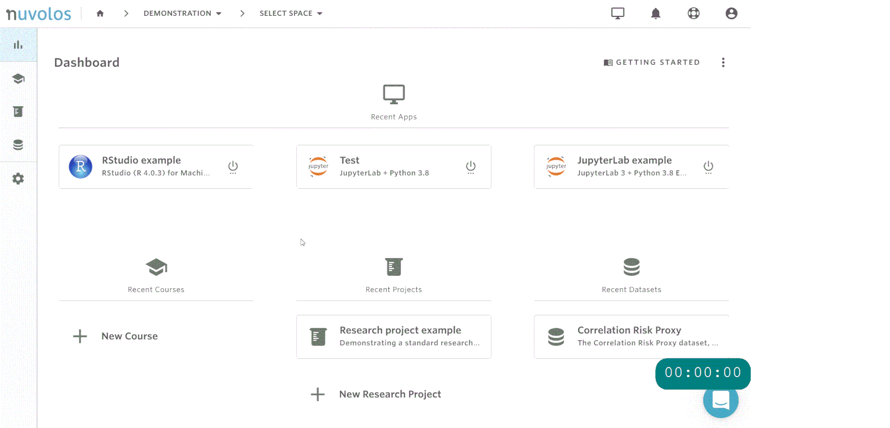

# High-performance computing \(interactive\)

If a given computation requires a large number of CPUs or memory \(RAM\), it is possible to **scale** the application to a **dedicated high-performance compute node**. In this case the same application will launch with the exact same interface, however the available resources can be significantly larger \(e.g. up to 64 vCPU and 256GB memory\) or can include additional devices \(e.g. a GPU\).


Application scaling is charged against the credits of the underlying account and is directly based on the amount of application runtime. Please turn off the scaled application if you no longer require the larger resources and relaunch it without scaling when the baseline resources are sufficient \(e.g. investigating outputs\).

Application timeouts are the same for scaled and non-scaled applications, so be sure to check on the calculations every 24 hours to ensure scaled applications are not turned off prematurely.


### How to scale your app

Scaling can be done inside Nuvolos by hovering on the application icon once it has been launched and clicking the 'Scale' button. High-performance computing integration needs to be enabled for this to be possible, please reach out to support using Intercom or by e-mail if you require assistance with this.

