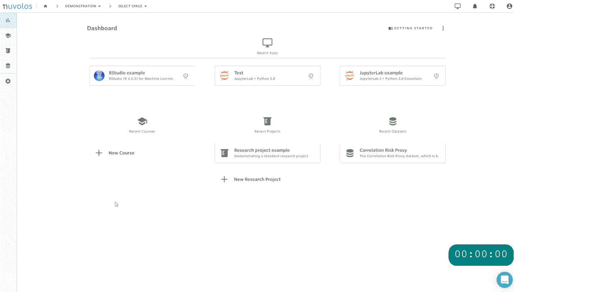

# High-performance computing \(interactive\)

If a given computation requires a large number of CPUs or memory \(RAM\), it is possible to **scale** the application to a **dedicated high-performance compute node**. In this case the same application will launch with the exact same interface, however the available resources can be significantly larger \(e.g. up to 120 vCPU and 456GB memory\) or can include additional devices \(e.g. a GPU\).


Application scaling is charged against the credits of the underlying account and is directly based on the amount of application runtime. Please turn off the scaled application if you no longer require the larger resources and relaunch it without scaling when the baseline resources are sufficient \(e.g. investigating outputs\).

For long running jobs you can also rely on the ****[**automated inactivity stopper**](../../getting-started/work-with-applications/long-running-applications.md) to handle application stops. The automated inactivity stopper will shut down the application if it is not using at least half of a single vCPU for computation and it is not opened in Nuvolos for at least 6 hours.


### How to scale your app

Scaling can be done inside Nuvolos by hovering on the application icon once it has been launched and clicking the 'Scale' button. High-performance computing integration needs to be enabled for this to be possible, please reach out to support using Intercom or by e-mail if you require assistance with this.



### Application specific notes

#### Rstudio

For Rstudio we recommend using the 'Local Jobs' feature to run the jobs in the background, this way you can submit multiple jobs whilst also making sure the job continues to run if you navigate away from Rstudio, without blocking the interface.


[Learn more about local jobs in Rstudio](https://github.com/rstudio/webinars/blob/master/74-background-jobs/slides.pdf)  

#### JupyterLab

If running notebooks via Jupyter, we recommend submitting the notebooks for computation  using [papermill](https://papermill.readthedocs.io/en/latest/) and specifying an explicit logfile when executing from the Jupyter terminal. This way you can disconnect from the Jupyter application and the notebook execution can continue whilst being able to monitor run progress.

```text
papermill --stdout-file /files/my_job.out --stderr-file /files/my_job.err NOTEBOOK_PATH [OUTPUT_PATH]
```

#### MATLAB

MATLAB constructs like [parfor ](https://www.mathworks.com/help/parallel-computing/parfor.html)can be leveraged on scaled applications using local [parallel pools](https://www.mathworks.com/help/parallel-computing/parpool.html). MATLAB detects the number of available cores only once on the first startup, so it's best to start the parallel pool manually for your computations with the appropriate number of workers and not let MATLAB figure it out automatically. It is recommended to set one less worker as available CPU, because the MATLAB master process also requires CPU power to orchestrate the pool.  
  
Example: if you've scaled up your application to 16 vCPU, then you should start a pool with 15 workers:

```text
pp = parpool('local', 15);
```

The pool will be deleted after 30 minutes of idle time or with an application restart. To delete it manually, use

```text
pp.delete()
```


 

