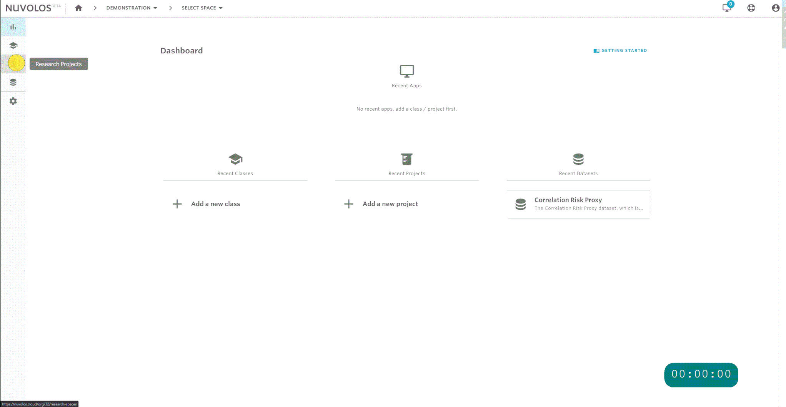
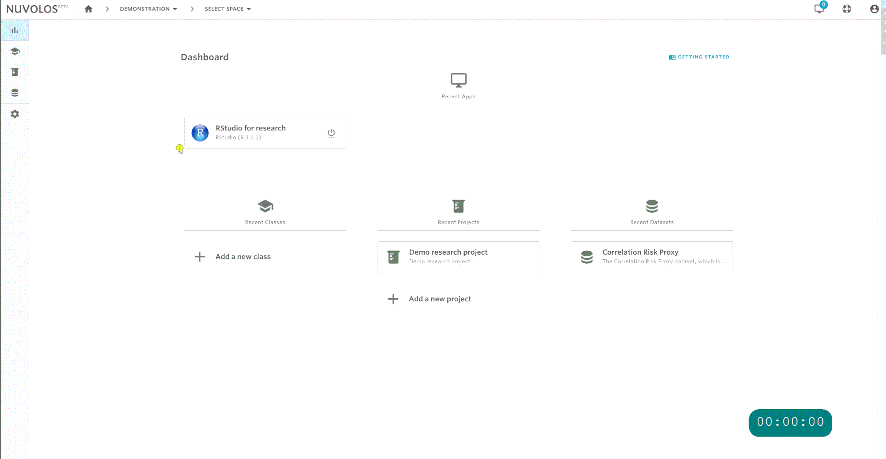

# Get started

## Set up a research project

Research projects are spaces in Nuvolos where researchers can store and work on their code and data. Organization managers or faculty members may create research projects.

1. Navigate to _Research Projects_
2. Select "NEW RESEARCH PROJECT"
3. Enter desired project name and description
4. Select "ADD SPACE"
5. Select application
6. Enter desired application name
7. Select "ADD APPLICATION"

When you create a research project, the project initializes with an instance called "Master instance". This is where the application will also be added.

## Add material to the project

You can add files and source code to your project via the file download/upload feature of Nuvolos.

## Create alternate approaches

Creating alternate approaches in your research project can be done in two steps:

1. Create a new instance with an appropriate name.
2. Distribute material from the main master instance.
3. You will need to be comfortable with context switching, we suggest to take a look at our [navigation guide](../getting-started/navigation-in-nuvolos.md).

#### Create new instance

To create an instance:

1. Navigate to the overview of any instance in your space \(you can do this from the dashboard\).
2. Click on the gear button on the sidebar or equivalently the "Project Users" tile.
3. Switch to the instances tab and select "ADD NEW INSTANCE"
4. Pick whether you want to create an empty instance or to initialize it from an existing snapshot.
5. Name and describe your instance.

#### Distribute material to modify

To distribute some material:

1. First navigate to the files, applications you want to distribute.
2. Click on the stage button for the objects you want to distribute.
3. Click on the distribute menu on the sidebar or on the overview.
4. Follow the steps of distribution, for more details, refer to [our detailed guide](../getting-started/distribute-objects-in-nuvolos/).

In the following example, we distribute two files and an application to the previously created empty instance.


Distribution is an asynchronous task - once you initiate it, it will run in the background. You will receive an e-mail with the outcome of a distribution.  
If the distribution fails for some reason, do not hesitate to contact us at [support@nuvolos.cloud](mailto:support@nuvolos.cloud).


Once the distribution has completed, we can verify that the distributed items are still there.

## Invite collaborators

You can invite collaborators if you are a [space admin](../settings-and-administration/role-system.md#space-admin) in a research project. By default the creator of the project automatically becomes space admin, every other user has to be invited specifically with that role.

### Invite co-authors with space admin rights


If you invite a co-author to your project as a space admin, restricted to the project, they will receive every possible right, including the ability to invite additional co-authors, create alternate instances and deleting the project itself.


To invite a co-author, do the following steps:

1. Navigate to your space.
2. U

### Invite co-authors with editor rights

## Work with applications

## Work with data

