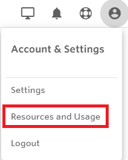
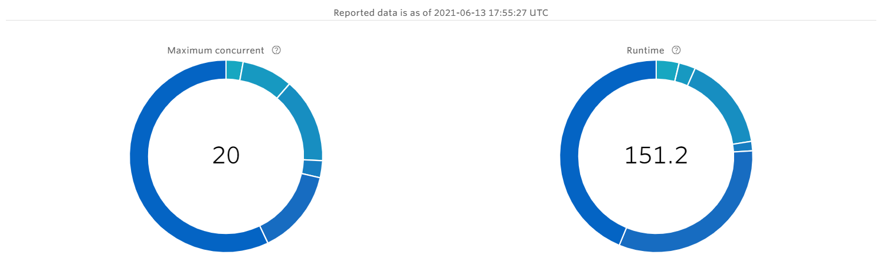
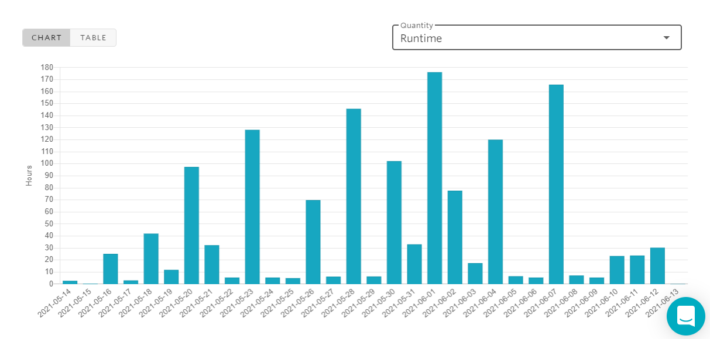

# Monitoring resource usage


We strongly suggest reading the [billing overview](./) before reading this page as there are some critical concepts to get familiar with.


Resource monitoring is possible to a different extent for all users. The view provided by the monitoring interface depends on your roles related to the resource pool you are viewing.

* All users are capable of seeing a minimal overview of the resource pools they are members of. The globally available information consists of the current balance and size of the resource pool.
* [Resource pool](resource-pools.md) managers can review activity in the resource pool they are managers in, and they can drill to review usage on the space level.
* Space administrators can review activity in the space they are administrating.

## The resource and usage metrics dashboard

The resource and usage dashboard is available in the user menu for all users:

## Structure

### Main page

The main page provides an overview of the resource pool. The exact view provided to the user is [based on their role](resource-pools.md#resource-pool-roles).

### Usage views

Usage views are only available for users that are at least a space administrator in one of the spaces associated with the resource pool.

Currently, the usage metrics dashboard provides metrics on the following resource groups:

* Applications - metrics on standard Nuvolos application runs
* HPC usage - metrics on HPC jobs and interactive HPC applications run in the Nuvolos infrastructure
* User reports - metrics on user participation and activity


Please note that for privacy purposes we only show to the user the name of the space where they have a space administrator role. Every other space shows up with a numerical identifier. Usage may still be viewed, but contents of the space will not be visible to the user.


### Management view

The management view provides two menus:

* The contents menu shows for each \(redacted\) space the mapped [resource types](resource-pools.md#resource-types) of the space to the resource pool.
* The users menu shows for each \(redacted\) space the space administrator for reach out purposes.

## The resource usage metrics dashboard

All reports consist of three zones:

### Selectors and tabs

You can switch between report types using the tabs. Selector fields clarify the aggregation level and time range for the report.  

### Summary

The summary information is presented as a doughnut chart with a total in the middle for each relevant category for the report. By hovering over the edge of the doughnut chart, you are able to display drill-down information of the statistic you are viewing.


Special aggregation rules might apply to the summary and the drill-down information displayed - please confirm the interpretation section of the corresponding report type if you are not sure about how data might be related.


### Details

The detail section is presented below the summary section and contains time series and tabular representation of the selected time period. You can switch between chart and table representation on the top left corner and you can select the relevant time series on the top right corner for this view. The tabular section data can always be exported to an `xlsx` file.


Special aggregation rules might apply to how the information displayed in the summary section is related to how the information is displayed in the details section. Please make sure to consult the interpretation section of the relevant report category.


## General usage

All reports are context-sensitive and contain drill-down functionality while respecting user roles.

### Aggregation levels

There are currently two faceting options available on the dashboard interface: organization context and time window.

#### Organization context

Organization managers can select either 'All spaces' or just a particular space when filtering the data. By default 'All spaces' is selected. This selection corresponds to organization-level aggregation.

* Application and HPC metrics get aggregated to the organization level.
* User reports show organization-level roles - see the [user report section](monitoring-resource-usage.md#user-reports).
* Invitation reports show instance-level invitations aggregated to the organization level with drill-down to the space level as part of the doughnut-chart.

Space administrators automatically select the context space - organization managers can get this view either by navigating to the space overview or by explicitly selecting the space in the organization manager dashboard.

* Application and HPC metrics get aggregated to the space level.
* User reports show space-level roles - see the [user report section](monitoring-resource-usage.md#user-reports).
* Invitation reports show instance-level invitations aggregated to the space level with drill-down to the instance level as part of the doughnut-chart.

#### Time window

The time window of the report by default is the last 30 days, however, it is possible to choose different time windows \(the length of the window is always at maximum of 30 days\). 


Changing resource mappings are not immediately reflected in usage reports. The changes will appear in the next report release \(our current schedule is at least one report a day\).



Please refer to the appropriate report section for the available time window for a particular type of report. 

Application and HPC reports concern 'flow' type of resource usage while invitation and user reports concern 'stock' type of system status, so interpretation of values is different in the two report classes.


## Application reports

Application reports give information on applications run on Nuvolos. The reporting unit is always Nuvolos Compute Units \(NCUs\). One Nuvolos Compute Unit corresponds to one vCPU and 4 GBs of RAM.

### Report content

We report the following information on the dashboard:

* **Maximum concurrent** - Maximum number of concurrent NCUs used a given day and for a given time period: the count of the widest activity of NCU use between 0:00 - 23:59 for a given date or taken over a time window. Rule \[1\] in the methodology section applies.
* **Runtime** - Total amount of time applications were running on a given day or for a given time period. The value is always given in hours. Rule \[1\] in the methodology section applies.

### Interpretation

Some general guidance to interpreting values:

* When a time period is selected, all application metrics are aggregated over the selected time period. Runtime is summed, while for the Maximum concurrent metric, maximum is taken over the selected time period.
* When viewing daily information \(as time series\), values presented are daily sums for Runtime, and daily maxima are presented for Maximum concurrent.
* The summary values correspond to the sum of the time series for Runtime. The summary values correspond to the maxima of the time series for Maximum concurrent.

### Methodology

Application reports are prepared on a daily basis, the latest report runtime is shown in the report. Previous reports are stored for 30 days, then removed.

1. Application reports on a given date report about applications that have concluded \(killed, stopped, timed out\) until the reporting timestamp. 
2. The time window reported on is the reporting day minus at least 60 calendar days to the reporting date. 
   1. For example, for the report on 2020-12-24, we guarantee that the report will contain data going back to 2020-10-25 and until 2020-12-24 02:00.

## HPC reports

HPC reports give information on HPC batch jobs and HPC interactive, scaled applications run on Nuvolos. 

### HPC Batch Report content

We report the following information on the dashboard:

* **Submitted** - Number of submitted jobs on a given day and for a given time period: the count of the job activity between 0:00 - 23:59 for a given date or taken over a time window. Rule \[1\] in the corresponding methodology section applies.
* **CPU hour** - Total amount of computational resources used on a given day and for a given time period: the sum total of CPU hours used between 0:00 - 23:59 or taken over a time window. Rule \[1\] and Rule \[2\] in the corresponding methodology section apply.
* **Balance used** - Based on the resource requirement and runtime of jobs the total amount of balance used by HPC jobs in the viewed context.

### Interpretation

Some general guidance to interpreting values:

* When a time period is selected, all HPC metrics are summed over the selected time period.
* When viewing daily information \(as time series\), values presented are daily sums. The summary values correspond to the sum total of the time series.

### Methodology

HPC reports are prepared on a daily basis, the latest report runtime is shown in the report. Previous reports are stored for 30 days, then removed.

1. HPC reports on a given date report about HPC that have concluded \(killed, canceled, completed, failed\) until the reporting time. 
2. HPC jobs are accounted for in totality on the day of conclusion \(job state is killed, canceled, completed, failed, _not_ running, or pending\).
3. The time window reported on is the reporting day minus at least 60 calendar days to the reporting date. 

### HPC Interactive Report content

We report the following information on the dashboard:

* **Runtime** - Total amount of runtime used for a given time period: the sum total of CPU hours used between 0:00 - 23:59 or taken over a time window. Rule \[1\] and Rule \[2\] in the corresponding methodology section apply.
* **Balance used** - Based on the resource requirement and runtime of apps the total amount of balance used by interactive HPC apps in the viewed context.

### Interpretation

Some general guidance to interpreting values:

* When a time period is selected, all HPC metrics are summed over the selected time period.
* When viewing daily information \(as time series\), values presented are daily sums. The summary values correspond to the sum total of the time series.

### Methodology

HPC reports are prepared on a daily basis, the latest report runtime is shown in the report. Previous reports are stored for 30 days, then removed.

1. HPC interactive applications are accounted for for the _starting date_ of the application run.
2. The time window reported on is the reporting day minus at least 60 calendar days to the reporting date. 

## User reports

User reports give information on user activity and density on Nuvolos. This information is most valuable during onboarding periods and project archival actions.

### Report content

We report the following information on the dashboard. Compared to application and HPC reports, the values reflect point-in-time information as of the report being made, and a comparison is possible between reports previously made. For a detailed guide on the role system please refer [here](../role-system.md).

#### Organization-level

In general, when viewed as a time series, the time series reflects information as of a date 02:00 AM CEST.

Some general remarks to interpret the data precisely:

* **Manager** - number of organization managers as of a given date.
  * 
* **Faculty** - number of faculty members of the organization as of a given date.
  * When a time period is selected, the number of faculty members corresponds to the state of the system _as of the last report run date_ of the period.
  * When viewing daily information \(as time series\), values presented are states of the system at report run dates that fall in the period.
* **Member** - number of regular members of the organization as of a given date.
  * When a time period is selected, the number of regular members corresponds to the state of the system _as of the last report run date_ of the period.
  * When viewing daily information \(as time series\), values presented are states of the system at report run dates that fall in the period.

#### Space-level

* **Space administrator** - number of space administrators in the given space as of a given date. 
  * When a time period is selected, the number of space administrators corresponds to the state of the system _as of the last report run date_ of the period.
  * When viewing daily information \(as time series\), values presented are states of the system at report run dates that fall in the period.
* **End-user** - number of distinct non-space administrator users who have accepted their invitations into the given space as of a given date.
  * If a user is invited as an instance editor into two instances in a space, we count them as one. If they are also space administrators as well as having two explicit invitations, then they are not counted in this category.

#### Instance-level

* **Editor** - Number of instance editors in a given instance as of a given date.
* **Viewer** - Number of instance viewers in a given instance as of a given date.

### Interpretation

Some general guidance to interpreting values:

* When a time period is selected, the number of users \(any category\) corresponds to the state of the system _as of the last report run date_ of the period.
* When viewing daily information \(as time series\), values presented are states of the system at report run dates that fall in the period.

