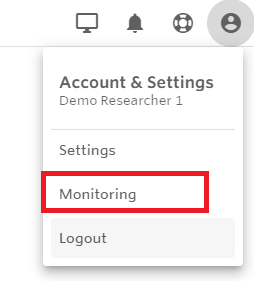
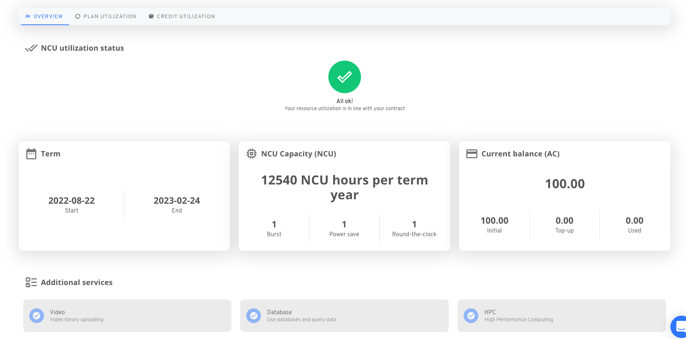
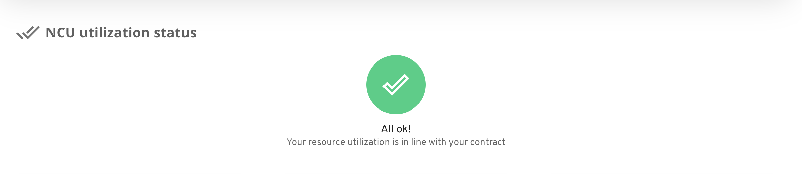

# Monitoring resource usage


We strongly suggest reading the [billing overview](./) before reading this page as there are some critical concepts to get familiar with.


Resource monitoring is possible to a varying extent for all users. The view provided by the monitoring interface depends on your roles related to the resource pool you are viewing.

* All users are capable of seeing a minimal overview and the credit usage of a resource pools if any of the following applies to them:
  * they are the managers of the [resource pool](resource-pools.md)
  * they have instance editor/space administrator role in a space belonging to the resource pool&#x20;
* [Resource pool](resource-pools.md) managers can review activity in the resource pool they are managers in, and they can drill down to review usage all the way until the space level.
* Space administrators can review activity in the space they are administrating.

## The monitoring dashboard

The usage monitoring dashboard is available in the user menu for all users in the top right corner of the screen:

## General usage

#### Drilling down

Drilling down to sub-levels is possible in the plan and credit utilization tab. The first and default level is the resource pool level. The next level is the organization level and lastly, the space level. &#x20;

* The resource pool level selector contains all the resource pools the user has sufficient roles to view.
* The organization level contains all the organizations linked directly to the resource pool, or organizations that contain a space that is linked to the resource pool. Resource pool managers will see all the organizations that match the description, however, other users will see a filtered result here, where only those organizations will be available which have spaces, where the user is a space administrator or editor in an instance within the space.
* The space level contains all the spaces in the selected organization that are linked to the selected resource pool. Resource pool managers will see all these spaces, while other users will only be able to select spaces where they are space administrators or instance editors in in instance within the space.

<figure><figcaption>
Drilling down to sublevels
</figcaption></figure>

#### Redaction

Due to privacy reasons, certain objects names are redacted on the monitoring dashboard. The following section clarify how redaction is applied in different places.

**Drill-down menu**&#x20;

* Resource pool and organization names will not be redacted for any users
* Space names
* Please note, that for privacy purposes we only show the user the name of the space if they are either space administrators or have an editor instance role in one of the instances of the space. Every other space shows up with a numerical identifier. Usage may still be viewed, but the content of the space will not be visible to the user.

**Plan and credit utilization tabs**

The donut charts on the plan and credit utilization tabs show the distribution of resources within the sub-level of the current level. At different levels, users might encounter some redacted names:

* Resource pool level:
  * No redaction
* Organization level:
  * Any space will be redacted where the user does not have a space administrator or instance editor role&#x20;
* Space level:
  * NCU and credit utilization charts drill down to user level (the charts show email addresses):
    * Resource pool managers will not have any redaction
    * Space administrators will not have any redaction
    * Instance editors will have every email redacted that is not their own
  * Filesystem utilization drill down to instance level
    * Resource pool managers will have every instance name redacted unless they are also a space administrator in the space  or have an editor role in the given instance
    * Space administrators will not have any redaction
    * Instance editors will have every instance redacted where they are not instance editors

#### Time range

The time window of the report by default is the current month, however, it is possible to choose different time windows (the length of the window is always a maximum of 1 year).&#x20;


The time range is shown on the plan or credit utilization tabs only, as the overview is time range independent. &#x20;


#### Enabling services

Resource pool managers can enable [additional services](resource-pools.md#enabling-services-resource-pool-level) on the overview page.

## Structure

### Main page

The main page provides an overview of the resource pool. The exact view provided to the user is based [on their role](https://docs.nuvolos.cloud/settings-and-administration/billing-budgeting-and-resource-pools/resource-pools#resource-pool-roles). &#x20;

All users are able to see the:

* terms of the contract
* NCU capacity of the contract. For more information about NCUs please refer to this [section](nuvolos-compute-units.md).
* current balance
* the status of the additional services in the resource pool

<figure><figcaption>
Overview tab for non resource pool managers
</figcaption></figure>

On top of these, resource pool managers are shown the [NCU utilization status](monitoring-resource-usage.md#ncu-utilization-status) and are able to enable additional services as described [here](resource-pools.md#enabling-services).

<figure><figcaption>
Overview for resource pool managers
</figcaption></figure>

#### NCU utilization status

The NCU utilization status gives information to the user about how the NCU utilization corresponds to the terms of the contract.

The NCU utilization status could be

* **in line**: Your resource utilization in line with your contract.

<figure><figcaption>
NCU utilization in line
</figcaption></figure>

* **overused**: You have already overused the resources in the current subscription period.

<figure><figcaption>
NCU utilization overused
</figcaption></figure>

* **expired**: The contract related to this resource pool has expired. You won't be able to use resources anymore.

<figure><figcaption>
NCU utilization for expired resource pool
</figcaption></figure>

* **projected overuse:** Your current utilization status is still in line with your contract, however, based on usage for some previous period, you will be overusing your resources by the end of the subscription period.

<figure><figcaption>
NCU utilization projected overuse
</figcaption></figure>

### Plan utilization view

The plan utilization view is only available for users that are resource pool managers at the resource pool.

Currently, the monitoring dashboard provides metrics on the following resource groups:

* NCU overview - metrics on standard Nuvolos application runs
* Filesystem utilization - metrics on filesystem usage on Nuvolos
* User activity overview - metrics on user activity on Nuvolos

#### NCU overview

The NCU overview shows a line and a donut chart for the NCU usage for the selected time range on the current drill-down level.&#x20;

<figure><figcaption>
NCU utilization
</figcaption></figure>

The NCU timeline shows a daily, weekly, or monthly grouped sum of the NCU hours used in the current drill-down level for the time range selected, and the donut chart shows the sum of the NCU hours for the sub-levels. The sub-levels are the following: Organizations for resource pool level, spaces for organization level, and users (email addresses) for space level.

#### Filesystem utilization

The filesystem utilization report consists of two charts, a timeline, and a donut chart. The timeline shows the filesystem utilization in GiBs grouped daily, weekly on monthly for the given time range. If the grouping is weekly or monthly the chart shows the filesystem utilization for the date shown when hovering over a bar. The donut chart shows the filesystem utilization by sub-level for the last date selected in the time range. The sub-levels are the following: Organizations for resource pool level, spaces for organization level, and instances for space level

<figure><figcaption>
Filesystem utilization
</figcaption></figure>


Please note, that the filesystem utilization reports are only available from 25/07/2022.


#### User activity overview

The user reports section provides a timeline for application runs. The timeline could be daily, weekly, or monthly depending on the time range selected.&#x20;

<figure><figcaption></figcaption></figure>

### Credit utilization view

The credit utilization view is available for everyone who is able to have access to a resource pool, however, what items are redacted or not is based on the user's role as described [here](monitoring-resource-usage.md#redaction).&#x20;

Currently, the monitoring dashboard provides three different charts for credit utilization.

* **Credit utilization by resources:**  This chart details the total credit utilization grouped by resource groups for the chosen time range. You can deselect resource groups by clicking on the resource icon on the left, or under the chart. Deselecting a resource will also remove it from the credit utilization by sub-levels chart.
* **Credit utilization by sub-levels:** This chart details the total credit utilization grouped by sublevels for the chosen time range. This is the following for the different levels: organizations for resource pool level, spaces for organization level, and users for space level. At each level, there may be credit usage that cannot be mapped to sub-levels, these will show up as orgless, spaceless, and userless transactions. You can deselect items from the sub-level, or a resource group by clicking on the resource icon on the left.

<figure><figcaption>
Credit utilization by resources (left) and credit utilizations by sub-levels (right) charts
</figcaption></figure>

* **Credit utilization timeline:** This chart details the credit utilization for the selected time range grouped daily, weekly, or monthly depending on the chosen time range. The colors in the bars correspond to the resource group.&#x20;

<figure><figcaption>
Credit utilization timechart
</figcaption></figure>

