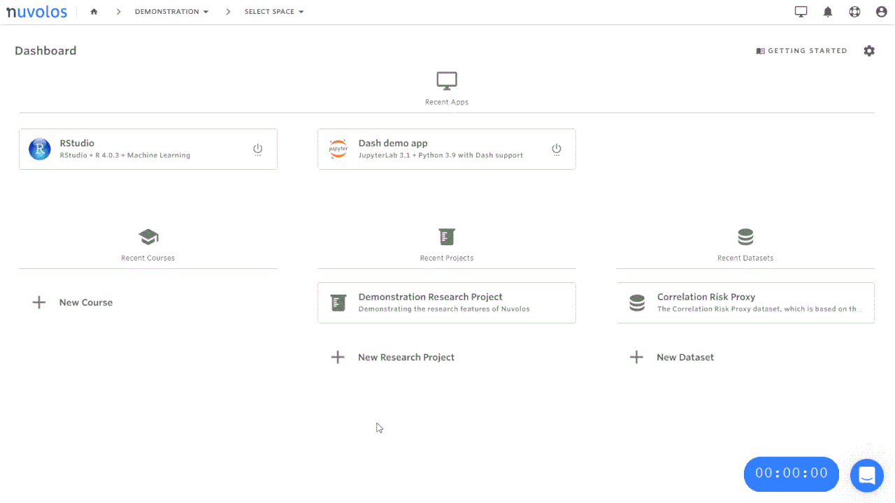

# Resource pools

Resource pools are the cost center units of Nuvolos. Resource pools are associated with the [tree structure](../../our-features/data-organization/) of Nuvolos. Organizations and spaces can be completely or partially mapped to Nuvolos via the management view of the Nuvolos resource control center. 


Resource pools hold a budget against which resources mapped to the resource pool account their usage.


## Resource pool mappings

We call associations between resource pools and Nuvolos objects _mappings._ The following type of objects can be mapped to resource pools:

* **Organizations**: An entire organization may be mapped to a resource pool. This means that all resource usage in the organization will be billed against the corresponding resource pool.
* **Spaces:** An entire space may be mapped to a resource pool. All usage in the space will be billed against the corresponding resource pool.
* **Specific resource**\(s\) **in a space**: A particular resource or set of resources may be mapped to a resource pool. This means that for example scaled computation may be mapped to a different resource pool in a space than all other resources.


It is not possible to map a specific resource in all organization objects to a particular resource pool - this can only be done on a space-by space basis.


### **Resource types**

The following resource types are available for mapping in Nuvolos currently \(the list may change with time as our offering evolves\):

* **File system storage**: File system storage currently used by the user.
* **Database storage**: Database storage in the Nuvolos Scientific Data Warehouse allocated to the user.
* **Database computation**: Database computation used by querying the Nuvolos Scientific Data Warehouse.
* **HPC interactive computation**: Any usage generated by using the [interactive high-performance computing](../../research/hpc-interactive.md) feature of Nuvolos.
* **HPC batch computation**: Any usage generated by using the [batch high-performance computing feature]() of Nuvolos.
* Professional services: Professional services carried out by the Nuvolos team, on agreed terms.
* **Nuvolos Compute Units**: General application runs, which count against the package-based quota specified in the service agreement.


Resource mappings are atomic: it is not possible to split the usage of a particular resource in a space between multiple resource pools. Consequently, it is **not** possible to:

* Split the file system storage between "normal" and "extra" and only allocate the "extra" to your resource pool. 
* Split the interactive high-performance computation costs in a particular space between resource pools depending on the node pool being used.

If you require such fine-grained splitting of resources, we suggest creating multiple spaces.


## Resource pool roles

The role structure of the resource pool builds on top of the Nuvolos role hierarchy while adding an additional administrative role. With respect to resource usage, you may anticipate the following patterns:

* **Instance viewers** cannot generate and resource consumption. Instance viewers may check the overall budget of their resource pool.
* **Instance editors** are able to generate resource consumption but they will not induce any change in the resource mappings of a resource pool. Instance editors may check the overall budget of their resource pool.
* **Space administrators** are able to generate resource consumption but they will not induce any change in the resource mappings of a resource pool. They are additionally able to see detailed usage of their own spaces as well as redacted information about other spaces in the resource pool.
* **Organization faculty** are able to create new spaces, thus implicitly change \(by adding more objects\) to the resource pool mapping, however, they may not explicitly re-map resources between resource pools.
* **Organization managers** are able to create new spaces, thus implicitly change \(by adding more objects\) to the resource pool mapping, however, they may not explicitly re-map resources between resource pools.
* **Resource pool managers** are able to check and modify the resource mapping of the resource pool as well as get information about the space administrators of spaces they might be interested in.


New resource pools can only be created by the Nuvolos support. Please reach out to us via intercom to originate a new resource pool.


## Mapping spaces to resource pools

Users who are **space administrators** of a space and **resource pool managers** of a resource pool may map all extra services to resource pools they are managers of. This is particularly useful for researchers who have their own research budget and work in a shared organization resource pool normally.

This mapping impacts:

* HPC interactive computation - any scaled application runs will be accounted against the selected resource pool.
* Database computation - any query compute time will be accounted against the selected resource pool.
* Database storage - any database storage hold of the space will be accounted against the selected resource pool.


The map does not impact regular provisions, such as NCU capacity for application runs and file system storage hold.


### Mapping a space upon space creation

To map a space upon creation to a particular resource pool, if you have resource pool management role in at least one resource pool, you will see a **Resource Pool dropdown** menu. Select the resource pool you want to map all the extra services in the space to. Following the selection, all extra services will be booked against the selected resource pool. The basic services will still be booked against the organization's default resource pool.

### Mapping a space during space lifetime

If you want to change the resource pool mapping of extra services for an existing space, you need to have both **space administrator** rights and **resource pool manager** rights in the resource pool you want to map to. 

In order to change the space mapping, navigate to **Project Configuration** from the space overview and select the resource pool in the **Resource Pool selection** menu item.


Please note that previous resource usage will not be re-mapped by changing the resource pool of a space. In order to reconcile previous usage, please reach out to our support.


