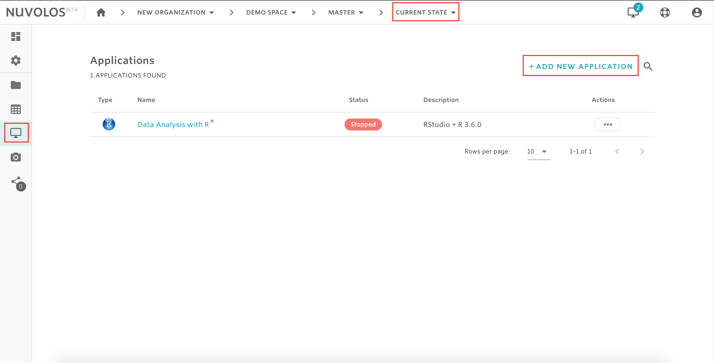
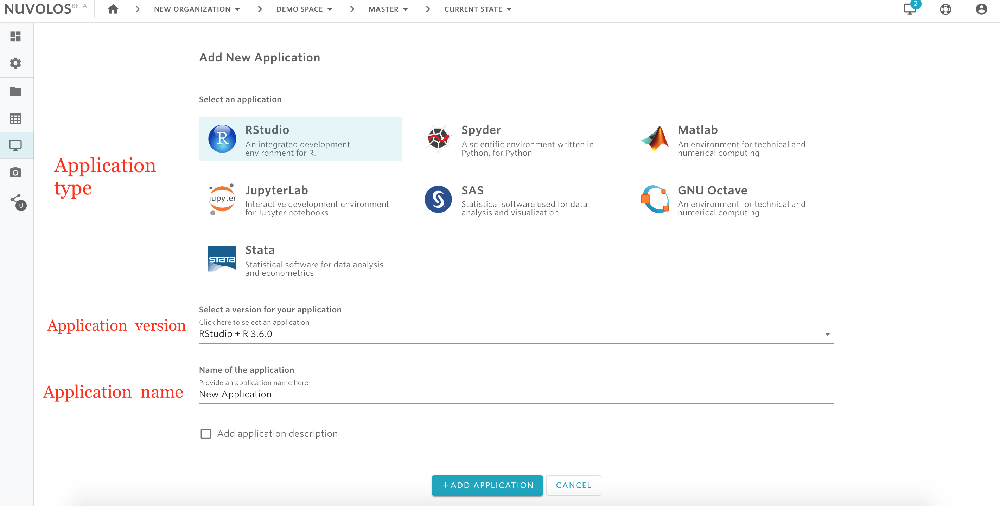

# Create an application

## To create a new application:

1- Make sure you are viewing the current state.

2- From the left sidebar, click on the desktop screen icon.

3- From the top right, click "ADD NEW APPLICATION"

4- Select the type and version of the application, and provide a name and \(optionally\) a description.

5- Click "ADD APPLICATION"

**If you are encountering a problem creating an application, refer to the troubleshooting guide** [**here**](../../troubleshooting/application-issues/cannot-create-an-application.md)**.**

  

\*\*\*\*

