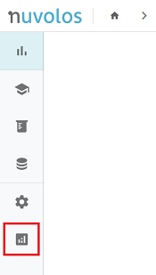
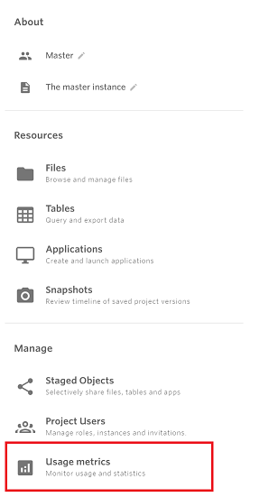
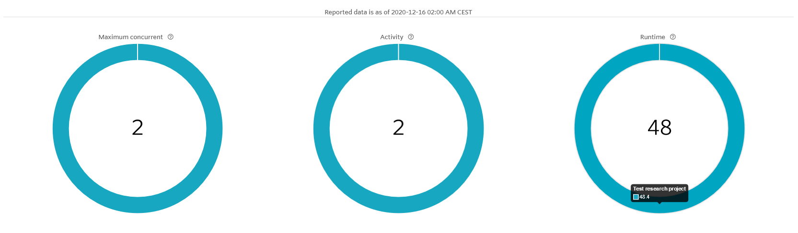
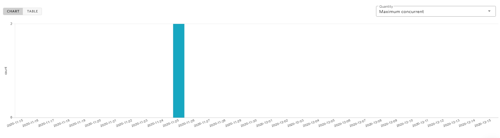

# Monitoring resource usage

Resource monitoring is possible for administrator-type users. Since Nuvolos roles are context-sensitive, the functionality is only available to you in the context where you have appropriate rights.

* Organization managers can review activity in the organization they are organization managers in, can drill down to the space and user level.
* Space administrators can review activity in the space they are administrating.

Currently the usage metrics dashboard provides metrics on the following resource groups:

* Applications - metrics on standard Nuvolos application runs
* HPC usage - metrics on HPC jobs run in the Nuvolos infrastructure
* User reports - metrics on user participation and activity
* Invitation reports - metrics on invitation activity

## The usage metrics dashboard

**Organization managers** can find the usage metrics view on the dashboard in the left hand sidebar:

**Space administrators** can find the usage metrics view in the overview of the space they are administrators in, in the right hand menu in the _Manage_ group.

Clicking on this menu will always bring you to the Usage metrics dashboard.

## Structure

All reports consist of three zones:

### Selectors and tabs

You can switch between report types using the tabs. Selector fields clarify the aggregation level and time range for the report. The refresh button \(highlighted\) loads the data with the updated selections. 

### Summary

The summary information is presented as a doughnut chart with a total in the middle for each relevant category for the report. By hovering over the edge of the doughnut chart, you are able to display drill-down information of the statistic you are viewing.


Special aggregation rules might apply to the summary and the drill-down information displayed - please confirm the interpretation section of the corresponding report type if you are not sure about how data might be related.


### Details

The detail section is presented below the summary section and contains time series and tabular representation of the selected time period. You can switch between chart and table representation on the top left corner and you can select the relevant time series on the top right corner for this view.


Special aggregation rules might apply to how the information displayed in the summary section is related to how the information is displayed in the details section. Please make sure to consult the interpretation section of the relevant report category.


## General usage

All reports are context sensitive and contain drill-down functionality, while respecting user roles.

For **organization managers**, available views are organization and space level, information will change according to what is intuitive and applicable at a certain level.

For **space administrators**, available views are space level, information will be available when applicable even on the instance level.

### Aggregation levels

There are currently two faceting options available on the dashboard interface: organization context and time window.

#### Organization context

Organization managers can select either 'All spaces' or just a particular space when filtering the date. By default 'All spaces' is selected. This selection corresponds to organization level aggregation.

* Application and HPC metrics get aggregated to the organization level.
* User reports show organization-level roles - see the [user report section](monitoring-resource-usage.md#user-reports).
* Invitation reports show instance level invitations aggregated to the organization level with drill-down to the space level as part of the doughnut-chart.

Space administrators automatically select the context space - organization managers can get this view either by navigating to the space overview or by explicitly selecting the space in the organization manager dashboard.

* Application and HPC metrics get aggregated to the space level.
* User reports show space-level roles - see the [user report section](monitoring-resource-usage.md#user-reports).
* Invitation reports show instance level invitations aggregated to the space level with drill-down to the instance level as part of the doughnut-chart.

#### Time window

The time window of the report by default is the last 30 days, however it is possible to choose different time windows \(the length of the window is always at maximum 30 days\). 


Please refer to the appropriate report section for the available time window for a particular type of report. 

Application and HPC reports concern 'flow' type of resource usage while invitation and user reports concern 'stock' type of system status, so interpretation of values is different in the two report classes.


## Application reports

Application reports give information on applications run on Nuvolos. 

### Report content

We report the following information on the dashboard:

* **Maximum concurrent** - Maximum number of concurrent applications run on a given day and for a given time period: the count of the widest activity of application use between 0:00 - 23:59 for a given date or taken over a time window. Rule \[1\] in the methodology section applies.
* **Activity** - Number of applications starts on a given day and for a given time period: the count of applications tarts between 0:00 - 23:59 or taken over a time window. Rule \[1\] in the methodology section _does not_ apply.
* **Runtime** - Total amount of time applications were running on a given day or for a given time period. The value is always given in hours. Rule \[1\] in the methodology section applies.

### Interpretation

Some general guidance to interpreting values:

* When a time period is selected, all application metrics are aggregated over the selected time period. Activity and Runtime are summed, while for the Maximum concurrent metric, maximum is taken over the selected time period.
* When viewing daily information \(as time series\), values presented are daily sums for Activity and Runtime, and daily maxima are presented for Maximum concurrent.
* The summary values correspond to the sum of the time series for Activity and Runtime. The summary values correspond to the maxima of the time series for Maximum concurrent.

### Methodology

Application reports are prepared on a daily basis, report runs are started 02:00 CEST. Previous reports are stored for 30 days, then removed.

1. Application reports on a given date report about applications that have concluded \(killed, stopped, timed out\) until the reporting date 02:00 CEST. 
   1. For example, for if you are looking at the report on 2020-12-24 12:15 CEST, then if an application was concluded at 2020-12-24 04:10 CEST, it will not be part of the day's report. However if you check back on 2020-12-25 09:15 CEST, the new report will contain this application run.
2. The time window reported on is the reporting day minus at least 60 calendar days to the reporting date. 
   1. For example, for the report on 2020-12-24, we guarantee that the report will contain data going back to 2020-10-25 and until 2020-12-24 02:00.

## HPC reports

HPC reports give information on HPC jobs run on Nuvolos. 

### Report content

We report the following information on the dashboard:

* **Submitted** - Number of submitted jobs on a given day and for a given time period: the count of the job activity between 0:00 - 23:59 for a given date or taken over a time window. Rule \[1\] in the corresponding methodology section applies.
* **CPU hour** - Total amount of computational resources used on a given day and for a given time period: the sum total of CPU hours used between 0:00 - 23:59 or taken over a time window. Rule \[1\] and Rule \[2\] in the corresponding methodology section applies.
* **GB RAM hour** - Total amount of memory resources used on a given day and for a given time period: the sum total of GB RAM hours used between 0:00 - 23:59 on a given date or taken over a time window. Rule \[1\] and Rule \[2\] in the corresponding methodology section applies. 

### Interpretation

Some general guidance to interpreting values:

* When a time period is selected, all HPC metrics are summed over the selected time period.
* When viewing daily information \(as time series\), values presented are daily sums. The summary values correspond to the sum total of the time series.

### Methodology

HPC reports are prepared on a daily basis, report runs are started 02:00 CEST. Previous reports are stored for 30 days, then removed.

1. HPC reports on a given date report about HPC that have concluded \(killed, cancelled, completed, failed\) until the reporting date 02:00 CEST. 
   1. For example, for if you are looking at the report on 2020-12-24 12:15 CEST, then if an HPC job was concluded at 2020-12-24 04:10 CEST, it will not be part of the day's report. However if you check back on 2020-12-25 09:15 CEST, the new report will contain this HPC job.
2. HPC jobs are accounted for in totality on the day of conclusion \(job state is killed, cancelled, completed, failed, _not_ running or pending\).
   1. For example if a job runs between 2020-12-01 0:01 and 2020-12-10 23:59, then the total runtime and resource usage is accounted on the date 2020-12-10 and will be first visible in the monitoring report on 2020-12-11.
3. The time window reported on is the reporting day minus at least 60 calendar days to the reporting date. 
   1. For example, for the report on 2020-12-24, we guarantee that the report will contain data going back to 2020-10-25 and until 2020-12-24 02:00.

## Invitation reports

Invitation reports give information on invitation activity on Nuvolos. This information is most valuable during onboarding periods to classes and research projects.

### Report content

We report the following information on the dashboard. Compared to application and HPC reports, the values reflect point-in-time information as of the report being made and comparison is possible between reports previously made.

* **Accepted** - Number of accepted invitations _up to_ a given day. When viewed as a time series, the time series reflects information up to a date 02:00AM CEST.
* **Pending** -  Number of pending invitations _up to_ a given day. When viewed as a time series, the time series reflects information up to a date 02:00AM CEST.
* **Total** - Total amount of invitations sent _up to_ a given day. When viewed as a time series, the time series reflects information up to a date 02:00AM CEST.

### Interpretation

Some general guidance to interpreting values:

* When a time period is selected, all invitation statistics correspond to the state of the system _as of the last report run date_ of the period.
* When viewing daily information \(as time series\), values presented are states of the system at report run dates that fall in the period.

### Methodology

Invitation reports are prepared on a daily basis, report runs are started 02:00 CEST. Previous reports are stored for 60 days, then removed.

1. Invitation reports on a given date report about the invitation status of a given entity _as of_ 02:00 CEST of the given date.
   1. For example, for if you are looking at the report on 2020-12-24 12:15 CEST, and you see 2 pending invitations in a given space, this means that at 2020-12-24 02:00 CEST there were 2 pending invitations.
2. _Time comparison between dates_: since per Rule \[1\] invitation reports refer to a state of the system as of a given a date 02:00 CEST, date-by-date comparisons show the difference between two selected dates.

## User reports

User reports give information on user activity and density on Nuvolos. This information is most valuable during onboarding periods and project archival actions.

### Report content

We report the following information on the dashboard. Compared to application and HPC reports, the values reflect point-in-time information as of the report being made and comparison is possible between reports previously made. For a detailed guide on the role system please refer [here](role-system.md).

#### Organization-level

In general, when viewed as a time series, the time series reflects information as of a date 02:00AM CEST.

Some general remarks to interpret the data precisely:

* **Manager** - number of organization managers as of a given date.
  * 
* **Faculty** - number of faculty members of the organization as of a given date.
  * When a time period is selected, the number of faculty members correspond to the state of the system _as of the last report run date_ of the period.
  * When viewing daily information \(as time series\), values presented are states of the system at report run dates that fall in the period.
* **Member** - number of regular members of the organization as of a given date.
  * When a time period is selected, the number of regular members correspond to the state of the system _as of the last report run date_ of the period.
  * When viewing daily information \(as time series\), values presented are states of the system at report run dates that fall in the period.

#### Space-level

* **Space administrator** - number of space administrators in the given space as of a given date. 
  * When a time period is selected, the number of space administrators correspond to the state of the system _as of the last report run date_ of the period.
  * When viewing daily information \(as time series\), values presented are states of the system at report run dates that fall in the period.
* **End-user** - number of distinct non-space administrator users who have accepted their invitations into the given space as of a given date.
  * If a user is invited as instance editor into two instances in a space, we count them as one. If they are also space administrators as well as having two explicit invitations, then they are not counted in this category.

#### Instance-level

* **Editor** - Number of instance editors in a given instance as of a given date.
* **Viewer** - Number of instance viewers in a given instance as of a given date.

### Interpretation

Some general guidance to interpreting values:

* When a time period is selected, the number of users \(any category\) correspond to the state of the system _as of the last report run date_ of the period.
* When viewing daily information \(as time series\), values presented are states of the system at report run dates that fall in the period.

### Methodology

User reports are prepared on a daily basis, report runs are started 02:00 CEST. Previous reports are stored for 60 days, then removed.

1. User reports on a given date report about the user status of a given entity _as of_ 02:00 CEST of the given date.
   1. For example, for if you are looking at the report on 2020-12-24 12:15 CEST, and you see two end-users in a given space this means that at 2020-12-24 02:00 CEST there were two end-users in the space. If say a pending invitation \(as of 02:00\) has been accepted between 02:00 and 12:15, you will not see that reflected until the next day's report.
2. _Time comparison between dates:_ since per Rule \[1\] user reports refer to a state of the system as of a given a date 02:00 CEST, date-by-date comparisons show the difference between two selected dates.

