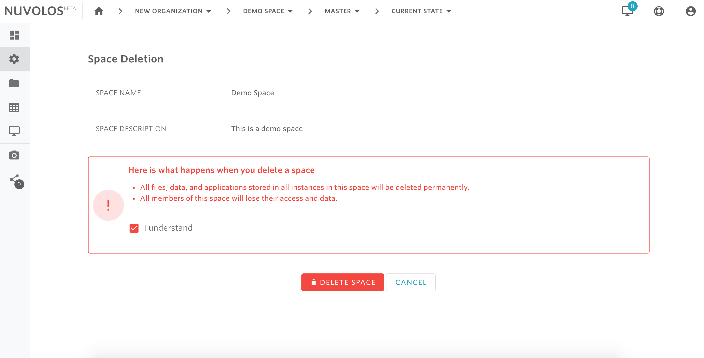

# Delete a space


Only space administrators have the ability to delete a space. Deleting a space will remove all content in it, including all instances and data contained in all instances. \
\
**This operation might impact a large number of users.**


## **To delete a space:**

1- Open the space by selecting it from the toolbar breadcrumbs or from the dashboard. For example, let's say we want to delete a space called "Demo Space". Clicking on 'Demo Space' vwill take us to the overview view.

\
2- From the left sidebar, hover on the settings icon and select Delete Space

3- Read the warning message, click "I understand", and then click DELETE SPACE.

#### If you are encountering a problem deleting a space, refer to the troubleshooting guide [here](../../troubleshooting/authorization-issues/cannot-delete-a-space-1.md).&#x20;

****

****
