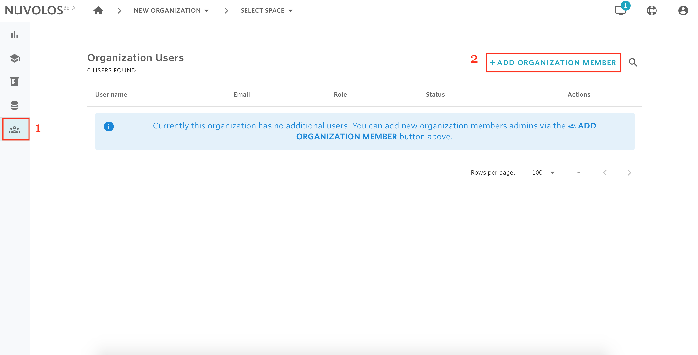

# Invite organization members


* At the organization level, there are two types of permission that can be granted: organization manager and organization faculty. For details on the types of rights each of these roles has, please read [here](../../our-features/data-organization/organizations.md).


## **To invite an organization member:**

1- From the home \(dashboard\) view, click the users icon on the sidebar to navigate to the list of users and then click on "ADD NEW ORGANIZATION MEMBER" from the top right.

  
2- Select the type of organization membership you want to invite the user with, and then provide the email\(s\) of the users you want to invite.

