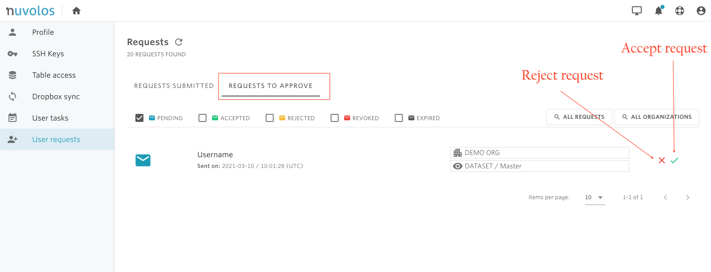

# Approve/Reject a request

**To approve a submitted request:**

1- [Find](find-requests.md) the user request you want to approve in the "REQUESTS TO APPROVE" section.

2- On the right side, use the green check button to approve a request, and the red clear button to reject the request.

