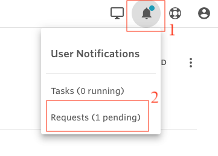
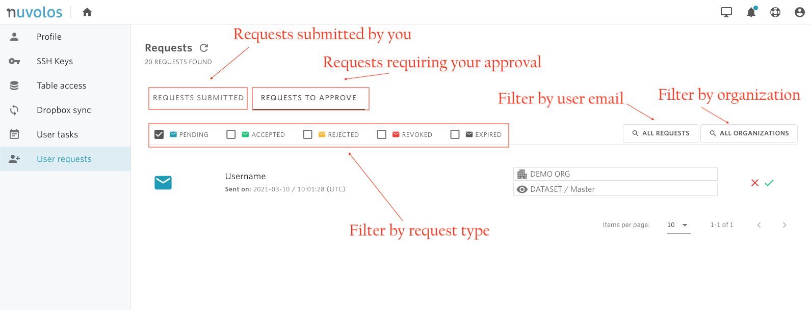

# Find a request

To find and review requests, you can use the notifications icon in the toolbar.

* Two types of requests will be displayed: requests submitted by the user waiting for approval and requests that require the approval of the user. 
* Using the colored mail checkboxes you can display all or specific types of requests \(e.g. pending requests only\). 
* When viewing the requests to approve, you can filter the requests by user name and organization.

