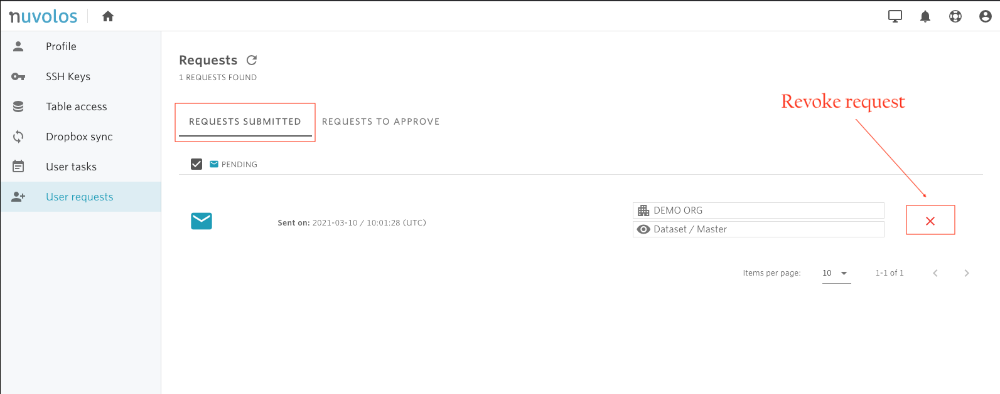

# Revoke a request

To revoke a request that you have submitted and is still waiting for approval, follow these two steps:

1- [Find](find-requests.md) the user request you want to approve in the "REQUESTS SUBMITTED" section.

2- On the right side, use the red clear button to revoke the request.

