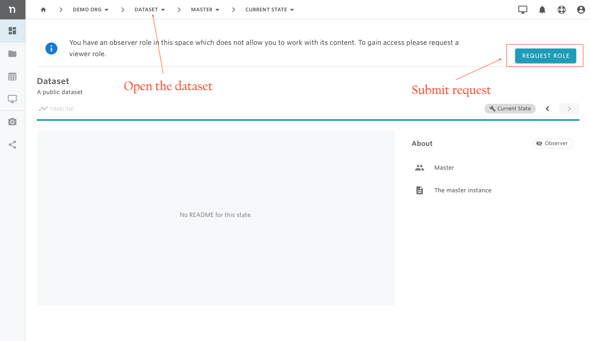

# Dataset viewer

Very often, invited users are automatically granted an 'observer' role for public datasets in the organization where they are invited. An observer role does not allow the user to see and interact with the contents of datasets, therefore, the user must submit a viewer role request.

**To ask for a viewer role in a public dataset:**

1- Open the dataset from the toolbar menu.

2- From the overview page, click on REQUEST ROLE.

Once the request has been submitted, the user needs to wait for the organization manager to approve their request before being able to view the dataset. Check the documentation [here](../find-requests.md) to find the list of submitted requests and their status. 

