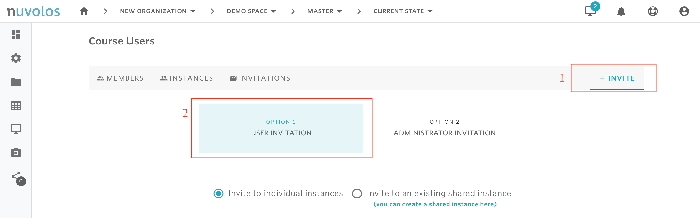

# Invite students


Only space administrators are allowed to invite students.


### To invite new students:

1. Open a course. In the following example, we open the course called "Demo Space".

&#x20;   2\. From the overview screen, click on "Course Users".

&#x20;   3\. Navigate to the "INVITE" tab and select "Option 1 - User Invitation"

&#x20;  4\. Choose the invitation method. Here, two options are available:

* **Invite via link**: With this method, a link will be shown that can be copied and made available to all students who should join the course. Upon opening the link, each student will be asked to provide their institutional email to which an invitation will be sent. Subsequently, by opening the invitation email, the student will be able to sign up for Nuvolos and join the course. This option might be preferred when a professor wants to invite multiple students to join a course.

.png>)

* **Direct email invitation**: With this method, you will need to provide the emails of the users that will be invited. To invite using direct email invitations, select the "Invite via email" option, provide the list of user emails, and click on "INVITE"

.png>)

#### If you are encountering a problem creating an instance, refer to the troubleshooting guide [here](../../troubleshooting/authorization-issues/cannot-create-an-instance.md).

****

****
