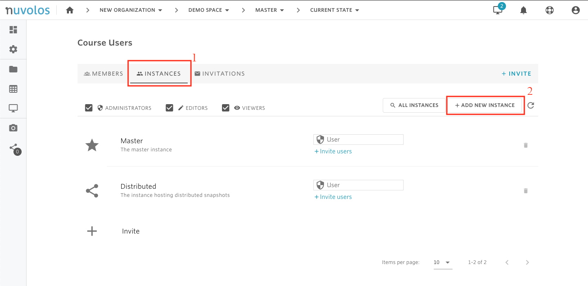
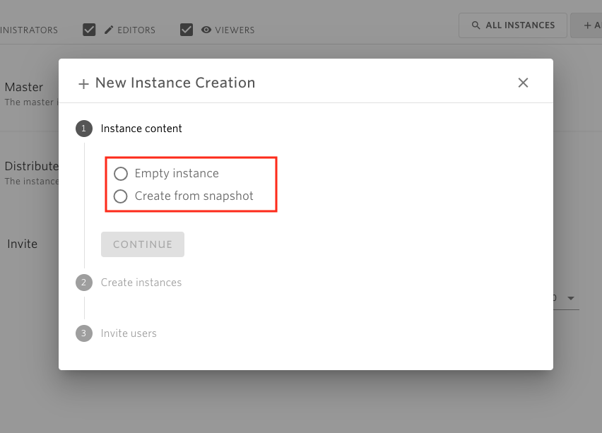
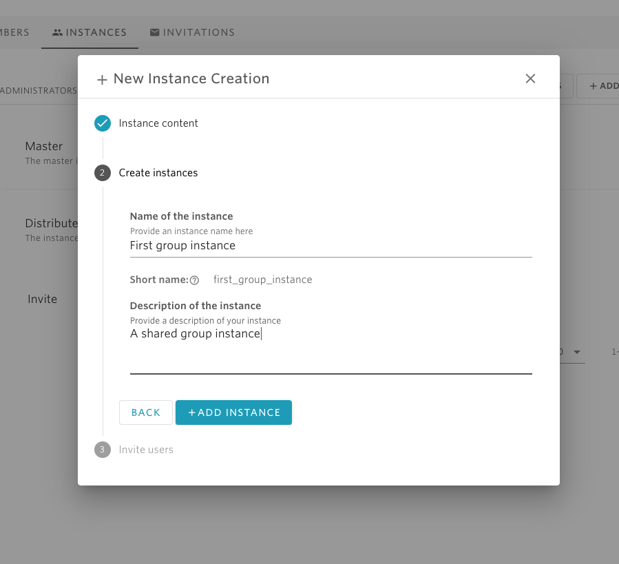
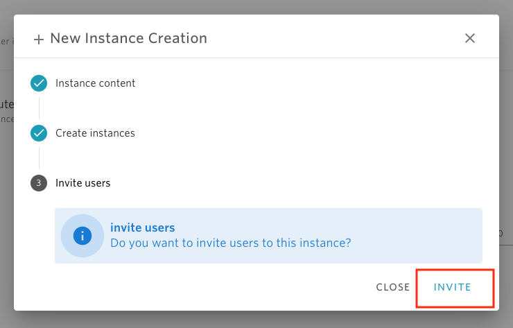
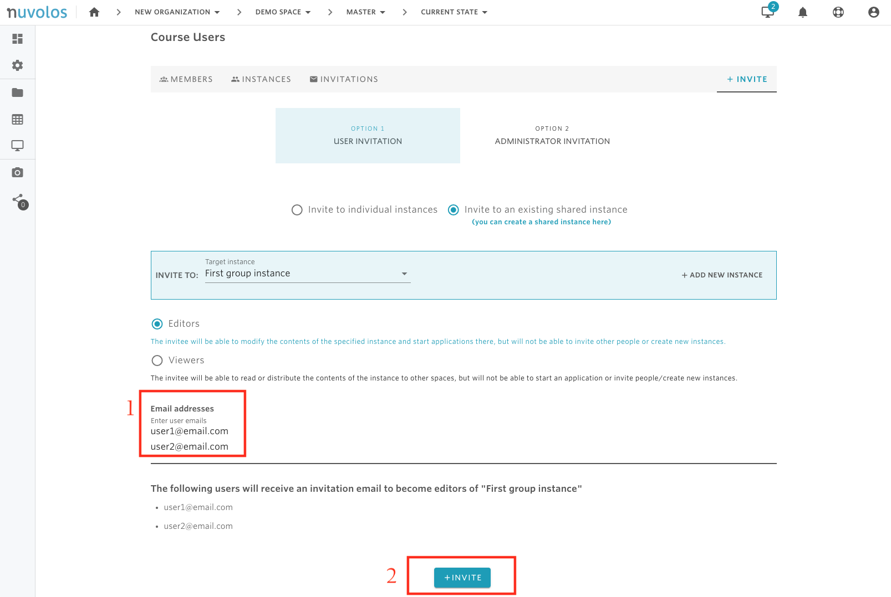

# Create shared instance

## To create a shared instance, the following steps are necessary:

1. Open a space (course or research project). In the following example, we open the course called "Demo Space".

&#x20;   2\. From the overview screen, click on "Course Users".

&#x20;   3\. Navigate to the "INSTANCES" tab and click on "ADD NEW INSTANCE"

&#x20;   4\. Choose between creating an empty instance or an instance with the contents of a snapshot and then click on "CONTINUE"

&#x20;   5\. Provide a name and a description for the instance.

&#x20;   6\. Once the instance has been created click on "INVITE"

&#x20;   7\. Provide the emails of users who will share the instance and click on "INVITE"

