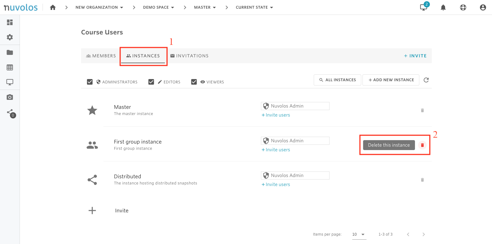
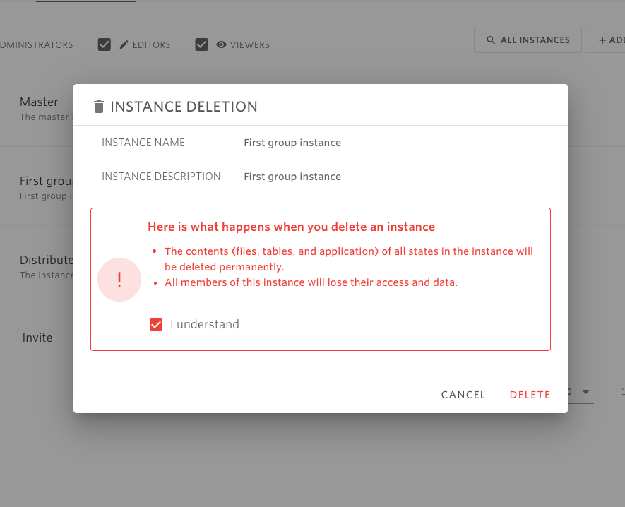

# Delete an instance


* Only space administrators are allowed to delete an instance.
* The Master and Distributed instances cannot be deleted.


## **To delete an instance:**

    1. Open a space \(course or research project\). In the following example, we open the course called "Demo Space".

    2. From the overview screen, click on "Course Users".

    3. Navigate to the "INSTANCES" tab, identify the instance you want to delete, and click on the red bin icon which you find on the right. In the example below, we delete the instance called "First group instance"

    4. Read the displayed text, accept if you agree, and click "DELETE".

#### If you are encountering a problem deleting a space, refer to the troubleshooting guide [here](../../troubleshooting/authorization-issues/cannot-delete-an-instance.md).

\*\*\*\*

