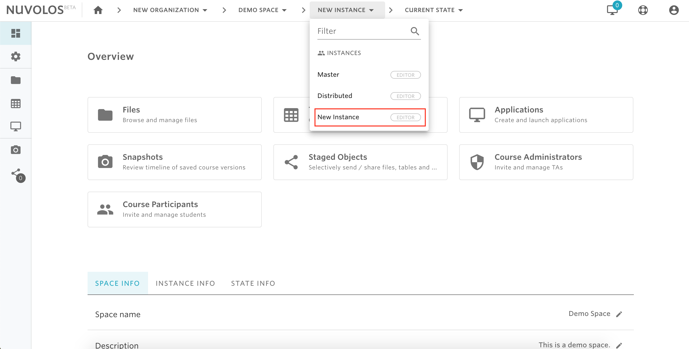
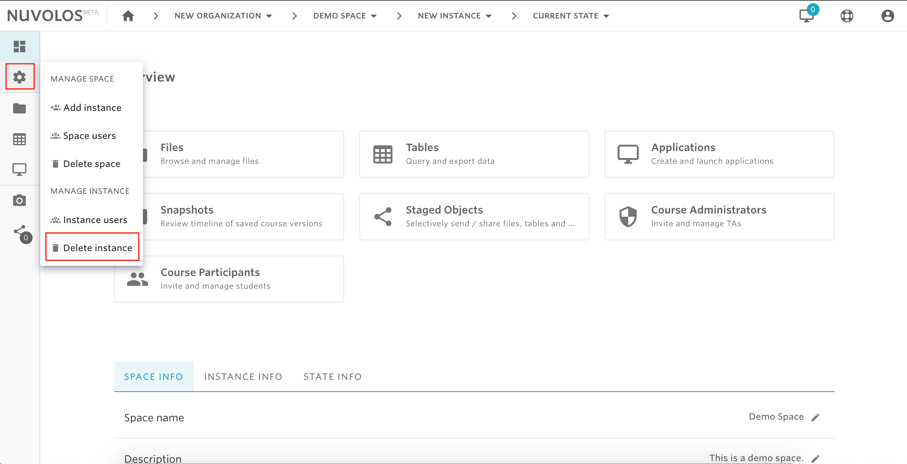
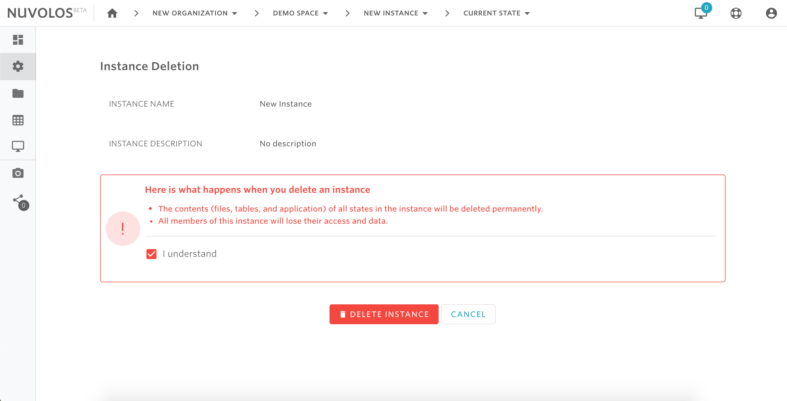

# Delete an instance


* Only space administrators are allowed to delete an instance.
* The Master and Distributed instances cannot be deleted.


## **To delete an instance:**

1.  From the toolbar breadcrumbs, select the instance you want to delete. For example, let's say we want to delete the instance called "New Instance" in the space "Demo Space"

2- From the left sidebar, hover on the settings icon and click "Delete instance"

3- Click "I understand" and then "DELETE INSTANCE"

#### If you are encountering a problem deleting a space, refer to the troubleshooting guide [here](../../troubleshooting/authorization-issues/cannot-delete-an-instance.md).

\*\*\*\*

