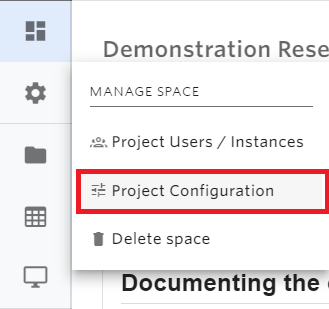
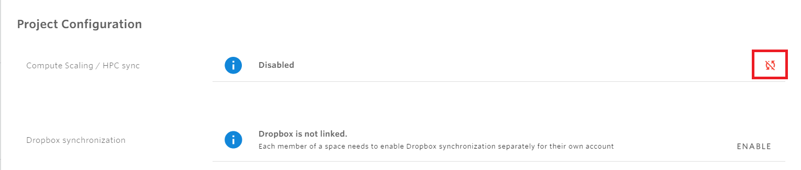

# Integrations

## HPC integration

For interactive or batch high-performance computing support, the space needs to have this feature enabled by the Space Administrator. Any user within a space will be able then to scale applications/ access the HPC cluster.

This can be enabled under the Project Settings &gt; Project Configuration menu on the sidebar:

Once in the configuration menu, toggle the enable/disable button to enable scaling. Please note that applications need to be restarted after clicking the enable button for the scaling options to become available.

