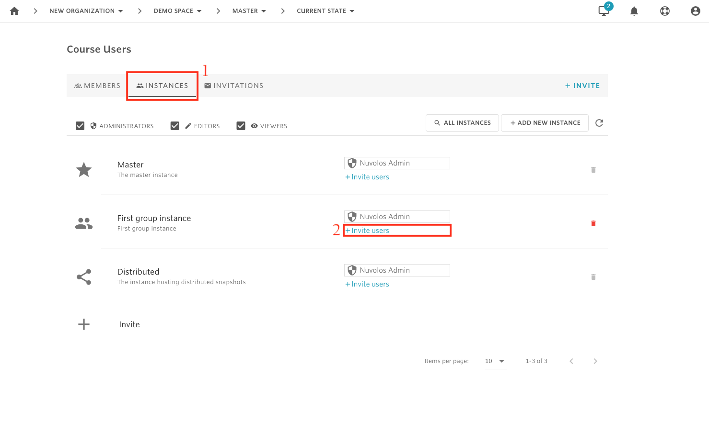
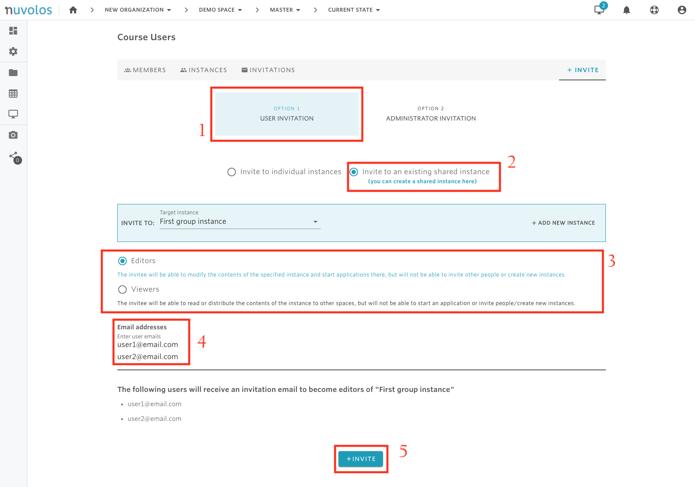

# Invite instance users


* At the instance level, there are two types of permission that can be granted: instance editor and instance viewer. For details on the types of rights each of these roles has, please read [here](../../our-features/data-organization/instances.md).
* Before granting access rights to an instance, make sure that the right permissions are set. Only space administrators are allowed to grant access right for an instance.


## **Create a new instance**

In order to create a new instance, follow our visual guide:

Step-by-step:

1. Navigate to the space where you want to create the instance.
2. Click on the **Project Users** icon in the **Manage** section of the right hand menu panel.
3. Click on **Invite** on the top right corner of the Project Users menu and click **Add new instance** in the Invite To field.
4. Select whether you want the instance to start from a snapshot or initialize it empty.
5. Fill out name and details.
6. Invite users if you need to.

## **To invite a new instance user:**

    1. Open a space \(course or research project\). In the following example, we open the course called "Demo Space".

    2. From the overview screen, click on "Course Users".

    3. Navigate to the "INSTANCES" tab, identify the instance you want to invite to, and click on "Invite users". In the example below, we invite users to the instance called "First group instance".

    4. Make sure you select "OPTION 1 - USER INVITATION" and "Invite to an existing shared instance".

    5. Select whether you want to invite instance editors or viewers.

    5. Provide the emails of the users you want to invite to the selected instance and finally click "INVITE".

#### If you are encountering a problem inviting instance users, refer to the troubleshooting guide here. 

