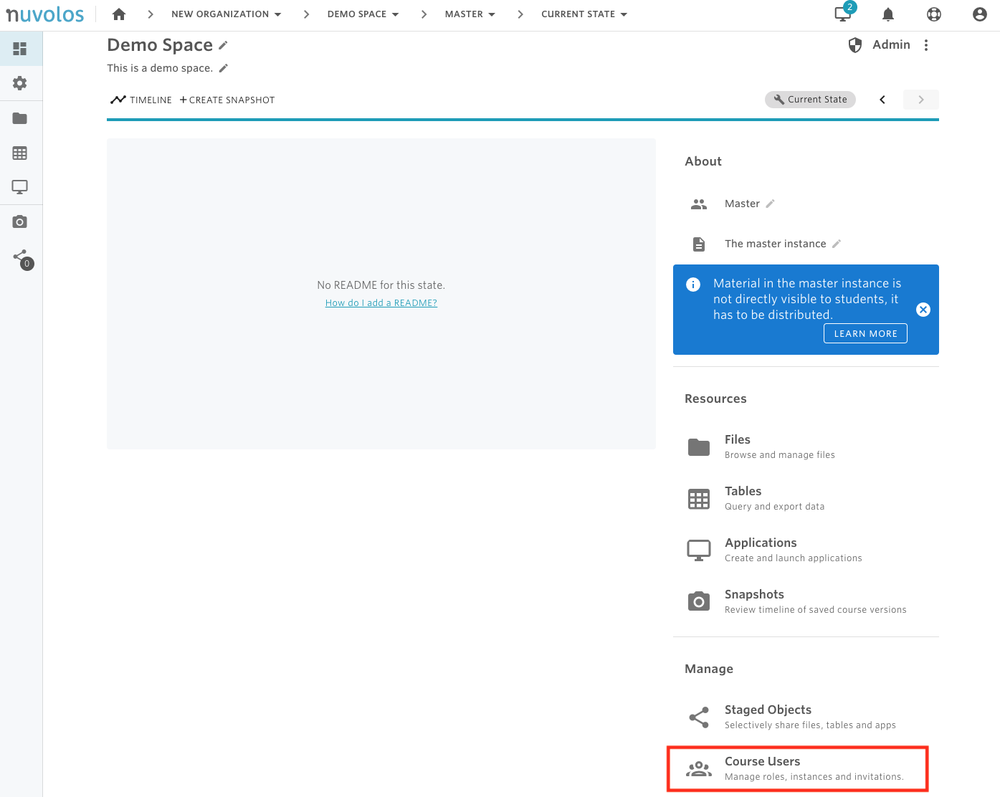
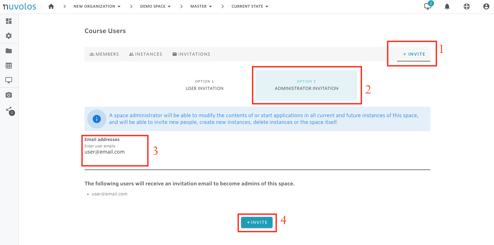

# Invite Space Administrators

### To invite space administrators:

1. Open a space. In the following example, we open the course called "Demo Space".

&#x20;   2\. From the overview screen, click on "Course Users".

&#x20;   3\. Navigate to the "INVITE" tab, select "Option 2 - Administrator Invitation", provide the emails of the users you want to invite, and click "INVITE".

#### If you are encountering a problem inviting instance users, refer to the troubleshooting guide here.&#x20;
