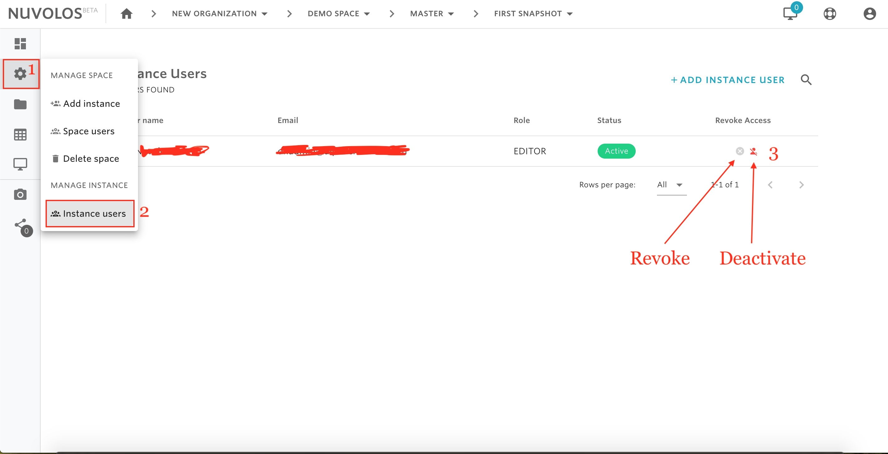

# Revoke/deactivate instance users


A space administrator can revoke or deactivate an instance.

* **Revoke** will simply revoke the instance role from the user. User account and instances/snapshots are not deleted, only the affected users won't see them anymore.
* **Deactivate** blocks user login, so it's a user-global operation.


## To revoke or deactivate an instance user:

1. Open a space.
2. From the left sidebar, click on the settings icon and select "Instance users".
3. From the user list, identify the user\(s\) you want to revoke/deactivate.
4. To revoke, click the red delete button, and to deactivate click on the red user cancel account button.

