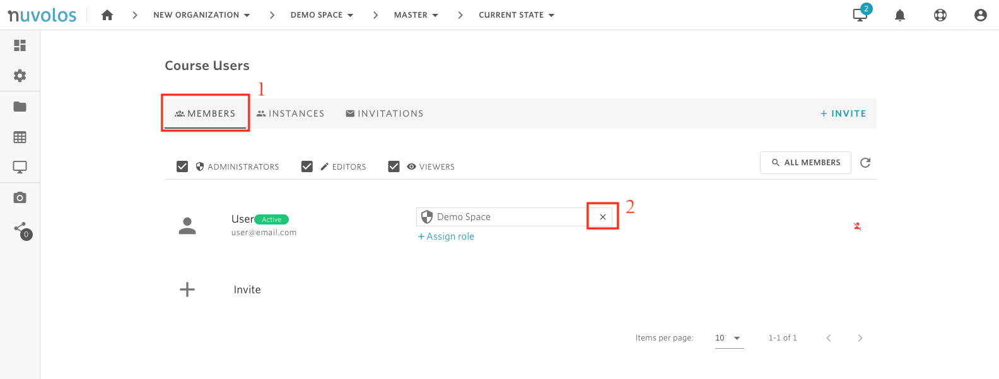

# Revoke a space administrator


Only a space administrator role or higher can revoke other space administrators.


### To revoke a space administrator:

1. Open a space. In the following example, we open the course called "Demo Space".

    2. From the overview screen, click on "Course Users".

    3. Navigate to the "MEMBERS" tab, identify the user, and click on the cross icon next to the role field.

    4. Select whether you want to revoke all instance-level roles as well or not by checking the "Revoke all instance roles for this user" box.

    5. Click "REVOKE"

