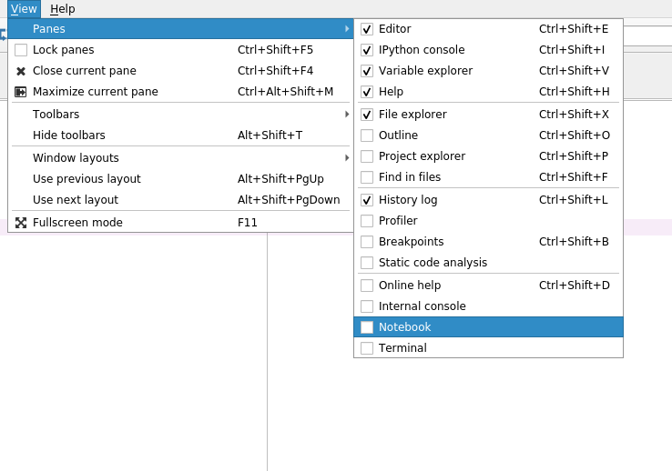
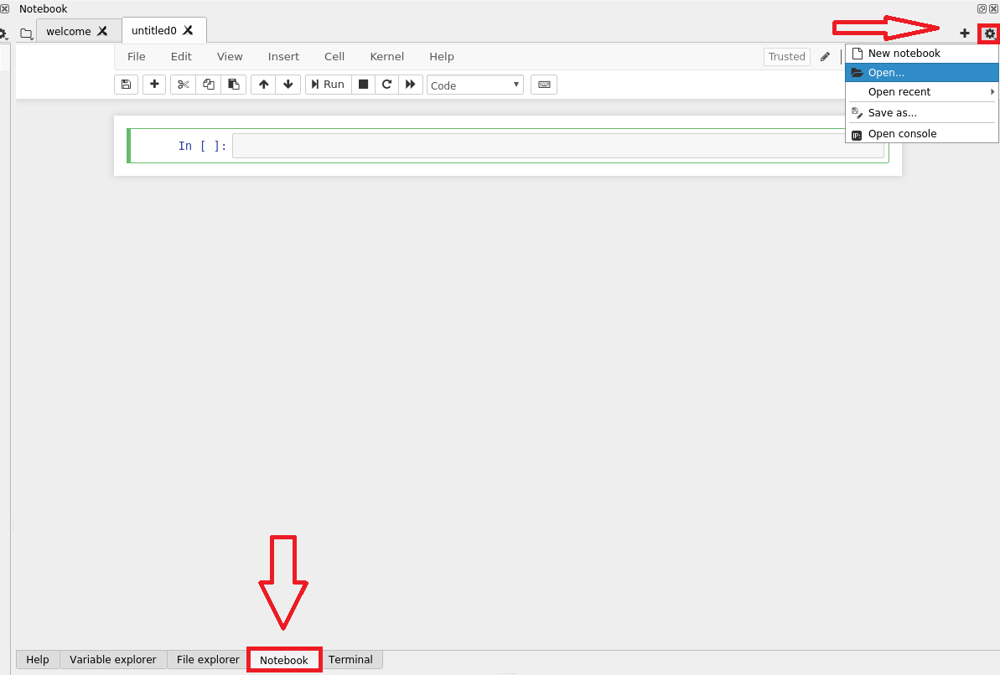

# Spyder 3.7 tips and tricks

## Running Jupyter Notebooks in Spyder 3.7

The Spyder 3.7 application is able to run and render Jupyter notebooks. This can be a necessary use-case  for example if you rely on libraries that use a windowing system. You will need to take the following steps:

1. Install by `mamba install -c spyder-ide spyder-notebook` in the Spyder Terminal. Please note that usually the terminal is the last sub-tab in the top right pane of Spyder.

     2. Enable the notebook view in the menu: **View &gt; Panes &gt; Notebook** by checking its tickbox.

   3. To open a notebook use the gear icon. 

