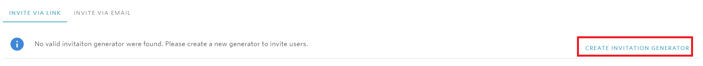

# The invitation link to my class is not working

Invitation links to classes have an expiry date - this is to protect your content from accidental access proliferation. The expiry date by default is three months after the creation of the space. After the expiry of the invitation link, if a potential user uses the link, their request will be rejected.

## Refreshing the link

To refresh the link, visit the invitation page. If the invitation link has expired, you will see that the invitation link section looks as follows:

In order to generate a new invitation link, click the highlighted button.

